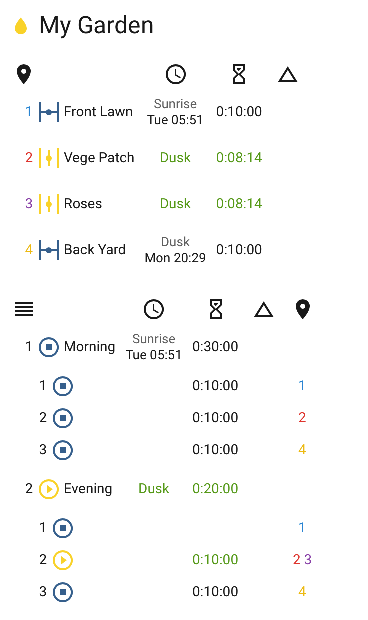

# Irrigation Unlimited

[![GitHub Release][releases-shield]][releases]
[![GitHub Activity][commits-shield]][commits]
[![License][license-shield]](LICENSE)

[![hacs][hacsbadge]][hacs]
![Project Maintenance][maintenance-shield]
[![BuyMeCoffee][buymecoffeebadge]][buymecoffee]

[![Community Forum][forum-shield]][forum]

<!-- TOC -->

- [Irrigation Unlimited](#irrigation-unlimited)
    - [Introduction](#introduction)
    - [Features](#features)
    - [Structure](#structure)
    - [Installation](#installation)
        - [Install from HACS](#install-from-hacs)
        - [Manual installation](#manual-installation)
    - [Configuration](#configuration)
        - [Controller Objects](#controller-objects)
        - [All Zone Objects](#all-zone-objects)
        - [Zone Objects](#zone-objects)
        - [Zone Show Object](#zone-show-object)
        - [Schedule Objects](#schedule-objects)
        - [Sun Event](#sun-event)
        - [Sequence Objects](#sequence-objects)
        - [Sequence Zone Objects](#sequence-zone-objects)
        - [Testing Object](#testing-object)
        - [Test Time Objects](#test-time-objects)
        - [Test Result Objects](#test-result-objects)
    - [Configuration examples](#configuration-examples)
        - [Minimal configuration](#minimal-configuration)
        - [Sun event example](#sun-event-example)
        - [Sequence example](#sequence-example)
        - [Simple water saving / eco mode example](#simple-water-saving--eco-mode-example)
        - [Every hour on the hour](#every-hour-on-the-hour)
        - [Seasonal watering](#seasonal-watering)
        - [Finish at sunrise](#finish-at-sunrise)
        - [Tips](#tips)
    - [Services](#services)
        - [Services enable, disable and toggle](#services-enable-disable-and-toggle)
        - [Service cancel](#service-cancel)
        - [Service manual_run](#service-manual_run)
        - [Service adjust_time](#service-adjust_time)
            - [Tip](#tip)
        - [Service reload](#service-reload)
        - [Service call access roadmap](#service-call-access-roadmap)
    - [Frontend](#frontend)
        - [Quick Start](#quick-start)
        - [Generic Cards](#generic-cards)
        - [Timeline](#timeline)
        - [Frontend Requirements](#frontend-requirements)
        - [Manual run card](#manual-run-card)
        - [Enable-disable card](#enable-disable-card)
    - [Automation](#automation)
        - [ESPHome](#esphome)
        - [HAsmartirrigation](#hasmartirrigation)
    - [Troubleshooting](#troubleshooting)
        - [Requirements](#requirements)
        - [Configuration](#configuration)
        - [Logging](#logging)
        - [Last but not least](#last-but-not-least)
    - [Notes](#notes)
    - [Contributions are welcome](#contributions-are-welcome)
    - [Credits](#credits)

<!-- /TOC -->

## Introduction

This integration is for irrigation systems large and small. It can offer some complex arrangements without large and messy scripts. This integration will complement many other irrigation projects.

Home Assistant makes automating switches easy with the built in tools available. So why this project? You have a system in place but now you have extended it to have a number of zones. You don't want all the zones on at once because of water pressure issues. Maybe you would like each zone to have a number of schedules say a morning and evening watering. What about water restrictions that limit irrigation systems to certain days of the week or days in the month, odd or even for example. Perhaps you would like different schedules for winter and summer. Now you would like to adjust the times based on weather conditions, past, present or future. Let's turn a zone or even a controller off for system maintenance. Starting to sound more like your system? Finally what's going on now and what's up next.

Each controller has an associated (master) sensor which shows on/off status and other attributes. The master will be on when any of its zones are on. The master sensor can have a pre and post amble period to activate or warm up the system like charge up a pump, enable WiFi or turn on a master valve. The master sensor has a number of service calls available to enable/disable all the zones it controls.

Zones also have an associated sensor which, like the master, shows on/off status and various attributes. Zones sensors have service calls that can enable/disable and provide manual runs. Also adjust run times in automation scripts using information from integrations that collect weather data like [OpenWeatherMap](https://www.home-assistant.io/integrations/openweathermap/), [BOM](https://github.com/bremor/bureau_of_meteorology), [weatherunderground](https://www.home-assistant.io/integrations/wunderground/) and many others. Go crazy with projects like [HAsmartirrigation](https://github.com/jeroenterheerdt/HAsmartirrigation). Easily integrate probes and sensors from [ESPHome](https://esphome.io) for real-time adjustments. Examples provided [below](#automation).

## Features

1. Unlimited controllers.
2. Unlimited zones.
3. Unlimited schedules. Schedule by absolute time or sun events (sunrise/sunset). Select by days of the week (mon/tue/wed...). Select by days in the month (1/2/3.../odd/even). Select by months in the year (jan/feb/mar...). Overlapped schedules.
4. Unlimited sequences. Operate zones one at a time in a particular order with a delay in between. A 'playlist' for your zones.
5. Hardware independent. Use your own switches/valve controllers.
6. Software independent. Pure play python.

\*Practical limitations will depend on your hardware.

## Structure

Irrigation Unlimited is comprised of controllers, zones and schedules in a tree like formation. Each controller has one or more zones and each zone has one or more schedules. Controllers and zones will have a binary sensor associated with each one so they can be intregrated with Home Assistant.

```text
└── Irrigation Unlimited
  └── Controller 1 -> binary_sensor.irrigation_unlimited_c1_m
    └── Zone 1 -> binary_sensor.irrigation_unlimited_c1_z1
      └── Schedule 1
      └── Schedule 2
          ...
      └── Schedule N
    └── Zone 2 -> binary_sensor.irrigation_unlimited_c1_z2
        ...
    └── Zone N -> binary_sensor.irrigation_unlimited_c1_zN
        ...
    └── Sequence 1
      └── Schedule 1
      └── Schedule 2
        ...
      └── Schedule N
      └── Zone 1
      └── Zone 2
        ...
      └── Zone N
    └── Sequence 2
      ...
    └── Sequence N
  └── Controller 2 -> binary_sensor.irrigation_unlimited_c2_m
      ...
  └── Controller N -> binary_sensor.irrigation_unlimited_cN_m
      ...
```

Controllers and zones can specify an entity such as a switch or light, basically anything that turns on or off the system can control it. This is the irrigation valve. If this does not go far enough for your purposes then track the state of the binary sensors in an automation and do your own thing like run a script or scene.

**This component will set up the following platforms.**

| Platform | Description |
| ---- | ---- |
| `binary_sensor` | Show a valve `on` or `off`|

A binary sensor is associated with each controller and zone. Controller or master sensors are named `binary_sensor.irrigation_unlimited_cN_m` and zone sensors `binary_sensor.irrigation_unlimited_cN_zN`. These sensors show the state of the master or child zones. Attributes show additional information like current schedule and next run time and duration.


## Installation

[HACS](https://hacs.xyz) is the recommended method for installation. If you are having difficulties then please see the _[troubleshooting guide](#troubleshooting)_

### Install from HACS

1. Just search for Irrigation Unlimited integration in [HACS][hacs] and install it.
2. Add Irrigation Unlimited to your configuration.yaml file. See _[configuration examples](#configuration-examples)_ below.
3. Restart Home Assistant.

### Manual installation

1. Using the tool of choice open the directory (folder) for your HA configuration (where you find `configuration.yaml`).
2. If you do not have a `custom_components` directory (folder) there, you need to create it.
3. In the `custom_components` directory (folder) create a new folder called `irrigation_unlimited`.
4. Download _all_ the files from the `custom_components/irrigation_unlimited/` directory (folder) in this repository.
5. Place the files you downloaded in the new directory (folder) you created.
6. Restart Home Assistant
7. In the HA UI go to "Configuration" -> "Integrations" click "+" and search for "Irrigation"

Using your HA configuration directory (folder) as a starting point you should now also have this:

```text
custom_components/irrigation_unlimited/__init__.py
custom_components/irrigation_unlimited/binary_sensor.py
custom_components/irrigation_unlimited/const.py
custom_components/irrigation_unlimited/entity.py
custom_components/irrigation_unlilmited/irrigation_unlimited.py
custom_components/irrigation_unlimited/manifest.json
custom_components/irrigation_unlimited/service.py
custom_components/irrigation_unlimited/services.yaml
```

## Configuration

Configuration is done by yaml. Note: The configuration can be reloaded without restarting HA. See [below](#service-reload) for details and limitations.

The time type is a string in the format HH:MM. Time type must be a positive value. Seconds can be specified but they will be rounded down to the system granularity. The default granularity is whole minutes (60 seconds). All times will be syncronised to these boundaries.

| Name | Type | Default | Description |
| -----| ---- | ------- | ----------- |
| `controllers` | list | _[Controller Objects](#controller-objects)_ | Controller details (Must have at least one) |
| `granularity` | number | 60 | System time boundaries in seconds |
| `refresh_interval` | number | 30 | Refresh interval in seconds. When a controller or zone is on this value will govern how often the count down timers will update. Decrease this number for a more repsonsive display. Increase this number to conserve resources.
| `history_span` | number | 7 | Number of days of history data to fetch |
| `history_refresh` | number | 120 | History refresh interval in seconds |
| `testing` | object | _[Testing Object](#testing-object)_ | Used for testing setup |

### Controller Objects

This is the controller or master object and manages a collection of zones. There must be at least one controller in the system. The controller state reflects the state of its zones. The controller will be on if any of its zones are on and off when all zones are off.

| Name | Type | Default | Description |
| ---- | ---- | ------- | ----------- |
| `zones` | list | _[Zone Objects](#zone-objects)_ | Zone details (Must have at least one) |
| `sequences` | list | _[Sequence Objects](#sequence-objects)_ | Sequence details |
| `name` | string | Controller _N_ | Friendly name for the controller |
| `enabled` | bool | true | Enable/disable the controller |
| `preamble` | time | '00:00' | The time master turns on before any zone turns on. This is in effect a delay-start timer, controller will turn on before the zones |
| `postamble` | time | '00:00' | The time master remains on after all zones are off. This is in effect a run-on timer, controller will turn off after the specified delay |
| `entity_id` | string | | Entity ID (`switch.my_master_valve1`). Takes a csv list for multiple id's |
| `all_zones_config` | object | _[All Zones Object](#all-zone-objects)_ | Shorthand default for all zones |

### All Zone Objects

This object is useful when the same settings are required for each zone. It is simply a shorthand or a more concise way to specify the same settings for each zone. The parameter becomes a default which can be overridden in the actual zone.

| Name | Type | Default | Description |
| ---- | ---- | ------- | ----------- |
| `minimum` | time | | The minimum run time |
| `maximum` | time | | The maximum run time |
| `future_span` | time | | Run queue look ahead |
| `show` | object | | See _[Zone Show Object](#zone-show-object)_ |

### Zone Objects

The zone object manages a collection of schedules. There must be at least one zone for each controller.

| Name | Type | Default | Description |
| ---- | ---- | ------- | ----------- |
| `schedules` | list | _[Schedule Objects](#schedule-objects)_ | Schedule details (Must have at least one) |
| `zone_id` | string | _N_ | Zone reference. Used for sequencing. |
| `name` | string | Zone _N_ | Friendly name for the zone |
| `enabled` | bool | true | Enable/disable the zone |
| `minimum` | time | '00:01' | The minimum run time |
| `maximum` | time | | The maximum run time |
| `future_span` | number | 3 | Number of days to look ahead |
| `entity_id` | string | | Entity ID (`switch.my_zone_valve1`). Takes a csv list for multiple id's |
| `show` | object | | See _[Zone Show Object](#zone-show-object)_ |

### Zone Show Object

These are various options to reveal attributes on the zone entity (only one for now).

| Name | Type | Default | Description |
| ---- | ---- | ------- | ----------- |
| `timeline` | bool | false | Show the zone timeline. This will expose an attribute called `timeline` on the zone entity |

### Schedule Objects

Schedules are future events, _not_ dates for example Mondays. There must be at least one schedule for each zone.

The schedule can have the commencement or completion fixed to a time or event with the `anchor` parameter. Any adjustments to the duration will alter the start time if `finish` is specified or the completion time if `start` is specified. Note: If anchoring to `finish` and the schedule can not complete before the specified time then the run will defer to the following day. This is an important consideration if adjusting run times dynamically as it may lead to a 'skipping' situation. Ensure there is sufficient time to complete the run when making adjustments. See _[here](#service-adjust_time)_ for more information on adjusting runs times.

The parameters `weekday`, `day` and `month` are date filters. If not specified then all dates qualify.

| Name | Type | Default | Description |
| ---- | ---- | ------- | ----------- |
| `time` | time/_[Sun Event](#sun-event)_ | **Required** | The start time. Either a time (07:30) or sun event |
| `anchor` | string | start | `start` or `finish`. Sets the schedule to commence or complete at the specified time |
| `duration` | time | | The length of time to run. Required for zones and optional for sequences |
| `name` | string | Schedule *N* | Friendly name for the schedule |
| `weekday` | list | | The days of week to run [mon, tue...sun] |
| `day` | list | | Days of month to run [1, 2...31]/odd/even |
| `month` | list | | Months of year to run [jan, feb...dec] |

### Sun Event

Leave the time value in the _[Schedule Objects](#schedule-objects)_ blank and add the following object. An optional `before` or `after` time can be specified.

| Name | Type | Default | Description |
| ---- | ---- | ------- | ----------- |
| `sun` | string | **Required** | `sunrise` or `sunset` |
| `before` | time | '00:00' | Time before the event |
| `after` | time | '00:00' | Time after the event |

### Sequence Objects

Sequences allow zones to run one at a time in a particular order with a delay in between. This is a type of watering 'playlist'. If a delay is specified and a pump or master valve is operated by the controller then consider the postamble setting in the _[Controller Object](#controller-objects)_. Set this to the largest delay to prevent pump on/off operations.

Sequences directly descend from a controller and are loosely connected to a zone entity via the `zone_id` parameter. The `zone_id` may point to one or many (a list) zone entities. A zone may be referenced more than once in a sequence.

```text
└── Irrigation Unlimited
      └──> Controller
            ├──> Zones
            │     ├──> Zone 1 <────┐
            │     ├──> Zone 2 <────┤
            │     │     ...        │
            │     └──> Zone N <────┤
            └──> Sequence          │
                  ├──> zone_id >───┤
                  ├──> zone_id >───┤
                  │      ...       │
                  └──> zone_id >───┘
```

| Name | Type | Default | Description |
| ---- | ---- | ------- | ----------- |
| `schedules` | list | _[Schedule Objects](#schedule-objects)_ | Schedule details (Must have at least one). Note: `duration` if specified is the total run time for the sequence, see below for more details |
| `zones` | list | _[Sequence Zone Objects](#sequence-zone-objects)_ | Zone details (Must have at least one) |
| `delay` | time | | Delay between zones. This value is a default for all _[Sequence Zone Objects](#sequence-zone-objects)_ |
| `duration` | time | | The length of time to run each zone. This value is a default for all _[Sequence Zone Objects](#sequence-zone-objects)_ |
| `repeat` | number | 1 | Number of times to repeat the sequence |
| `name` | string | Run _N_ | Friendly name for the sequence |
| `enabled` | bool | true | Enable/disable the sequence |

### Sequence Zone Objects

The sequence zone is a reference to the actual zone defined in the _[Zone Objects](#zone-objects)_. Ensure the `zone_id`'s match between this object and the zone object. The zone may appear more than once in the case of a split run.

| Name | Type | Default | Description |
| ---- | ---- | ------- | ----------- |
| `zone_id` | string/list | **Required** | Zone reference. This must match the `zone_id` in the _[Zone Objects](#zone-objects)_ |
| `delay` | time | | Delay between zones. This value will override the `delay` setting in the _[Sequence Objects](#sequence-objects)_ |
| `duration` | time | | The length of time to run. This value will override the `duration` setting in the _[Sequence Objects](#sequence-objects)_ |
| `repeat` | number | 1 | Number of times to repeat this zone |
| `enabled` | bool | true | Enable/disable the sequence zone |

Special note for [schedules](#schedule-objects) and the `duration` parameter contained within when used with sequences. Each zone in the sequence will be proportionaly adjusted to fit the specified duration. For example, if 3 zones were to each run for 10, 20 and 30 minutes respectively (total 1 hour) and the `schedule.duration` parameter specified 30 minutes then each zone would be adjusted to 5, 10 and 15 minutes. Likewise if `schedule.duration` specified 1.5 hours then the zones would be 15, 30 and 45 minutes. Some variation may occur due to rounding of the times to the system boundaries (granularity). This parameter influences the durations specified in the sequence and sequence zone objects.

### Testing Object

The testing object is useful for running through a predetermined regime. Note: the `speed` value does _not_ alter the system clock in any way. It is accomplished by an internal 'virtual clock'.

| Name | Type | Default | Description |
| ---- | ---- | ------- | ----------- |
| `enabled` | bool | true | Enable/disable testing |
| `speed` | number | 1.0 | Test speed. A value less than 1 will slow down the system. Values above 1 will speed up tests. A value of 2 will double the speed, 60 will turn minutes to seconds and 3600 will turn hours to seconds. Upper limit will depend on individual systems.|
| `show_log` | bool | true | Outputs controller and zones to the log |
| `output_events` | bool | false | Prints event information to the console. Useful for creating the _[Test Result Objects](#test-result-objects)_ |
| `auto_play` | bool | true | Automatically start tests |
| `times` | list | _[Test Time Objects](#test-time-objects)_ | Test run times |

### Test Time Objects

This is the test time object. Test times do _not_ alter the system clock so there is no danger of disruption to the Home Assistant system.

| Name | Type | Default | Description |
| ---- | ---- | ------- | ----------- |
| `name` | string | Test *N* | Friendly name for the test |
| `start` | datetime | | The virtual start time (YYYY-mm-dd HH:MM) |
| `end` | datetime | | The virtual end time (YYYY-mm-dd HH:MM) |
| `results` | list | _[Test Result Objects](#test-result-objects)_ | Expected timing results |

### Test Result Objects

These are the expected results from the test object. Every time a controller or zone turns on or off it is compared to the next item in this list. To aid in generating this list from scratch set `output_event` to `true` in the _[Testing Object](#testing-object)_. Events will be printed to the console which can be copied to this object.

| Name | Type | Default | Description |
| ---- | ---- | ------- | ----------- |
| `t` | time | required | The time of the event |
| `c` | int | required | The controller number |
| `z` | int | required | The zone number. Zone 0 is the master |
| `s` | int | required | 0 = Off and 1 = On |

For a more concise style, results can be on one line for example:

```yaml
results:
  - { t: "2021-01-04 06:00:30", c: 1, z: 0, s: 1 }
  - { t: "2021-01-04 06:00:30", c: 1, z: 1, s: 1 }
  - { t: "2021-01-04 06:10:00", c: 1, z: 2, s: 1 }
  - { t: "2021-01-04 06:10:30", c: 1, z: 1, s: 0 }
  - { t: "2021-01-04 06:20:00", c: 1, z: 2, s: 0 }
  - { t: "2021-01-04 06:20:00", c: 1, z: 0, s: 0 }
```

## Configuration examples

### Minimal configuration

```yaml
# Example configuration.yaml entry
irrigation_unlimited:
  controllers:
    zones:
      entity_id: "switch.my_switch"
      schedules:
        - time: "06:00"
          duration: "00:20"
```

### Sun event example

```yaml
# Example configuration.yaml entry
# Run 20 minutes before sunrise for 30 minutes
irrigation_unlimited:
  controllers:
    zones:
      entity_id: "switch.my_switch_1"
      schedules:
        - name: "Before sunrise"
          time:
            sun: "sunrise"
            before: "00:20"
          duration: "00:30"
```

### Sequence example

```yaml
# Example configuration.yaml entry
irrigation_unlimited:
  controllers:
    zones:
      - name: "Front lawn"
        entity_id: "switch.my_switch_1"
      - name: "Vege patch"
        entity_id: "switch.my_switch_2"
      - name: "Flower bed"
        entity_id: "switch.my_switch_3"
    sequences:
      - delay: "00:01"
        schedules:
          - name: "Sunrise"
            time:
              sun: "sunrise"
          - name: "After sunset"
            time:
              sun: "sunset"
              after: "00:30"
        zones:
          - zone_id: 1
            duration: "00:10"
          - zone_id: 2
            duration: "00:02"
          - zone_id: 3
            duration: "00:01"
```

### Simple water saving / eco mode example

```yaml
# Example water saver. Run for 5 min on 2 off repeat 3 times
irrigation_unlimited:
  controllers:
    zones:
      - entity_id: "switch.my_switch_1"
    sequences:
      - duration: "00:05"
        delay: "00:02"
        repeat: 3
        schedules:
          - time: "05:00"
        zones:
          - zone_id: 1
```

### Every hour on the hour

```yaml
# Example to run for 5 min every hour on the hour from 5am to 5pm
irrigation_unlimited:
  controllers:
    zones:
      - entity_id: "switch.my_switch_1"
    sequences:
      - name: "On the hour from 5am to 5pm"
        duration: "00:05"
        delay: "00:55"
        repeat: 12
        schedules:
          - time: "05:00"
        zones:
          - zone_id: 1
```

### Seasonal watering

```yaml
# Run 15 min 3 times a week in summer, 10 min once a week in winter and twice a week in spring/autumn
irrigation_unlimited:
  controllers:
    zones:
      - entity_id: "switch.my_switch_1"
        schedules:
          - time: "05:30"
            duration: "00:15"
            weekday: [mon, wed, fri]
            month: [dec, jan, feb]
          - time: "05:30"
            duration: "00:10"
            weekday: [sun]
            month: [jun, jul, aug]
          - time: "05:30"
            duration: "00:12"
            weekday: [mon, thu]
            month: [mar, apr, may, sep, oct, nov]
```

This is similar to the above but using sequences in a 3 zone system. Each zone runs for 12 minutes for a total of 36 min (plus delays). In Summer the total duration is extended to 45 minutes and winter reduced to 30 minutes. When using the `duration` parameter in the _[Schedule](#schedule-objects)_ it relates to the total duration of the sequence, each zone is adjusted accordingly.

```yaml
irrigation_unlimited:
  controllers:
    zones:
      - entity_id: "switch.my_switch_1"
      - entity_id: "switch.my_switch_2"
      - entity_id: "switch.my_switch_3"
    sequences:
      - name: "Run 1"
        duration: "00:12"
        delay: "00:01"
        schedules:
          - name: "Summer"
            time: "05:30"
            weekday: [mon, wed, fri]
            month: [dec, jan, feb]
            duration: "00:45"
          - name: "Winter"
            time: "05:30"
            weekday: [sun]
            month: [jun, jul, aug]
            duration: "00:30"
          - name: "Spring and Autumn"
            time: "05:30"
            weekday: [mon, thu]
            month: [mar, apr, may, sep, oct, nov]
        zones:
          - zone_id: 1
          - zone_id: 2
          - zone_id: 3
```

Just in case this does not go far enough then create three sequences with one schedule each. This will allow _complete_ control over _all_ aspects of the sequence including which zones to run, order, durations, delays, repeats etc. Still want more then create a sequence for each month of the year. This example reverses the order in Spring/Autumn for no good reason and excludes a zone in Winter.

```yaml
irrigation_unlimited:
  controllers:
    zones:
      - entity_id: "switch.my_switch_1"
      - entity_id: "switch.my_switch_2"
      - entity_id: "switch.my_switch_3"
    sequences:
      - name: "Summer"
        duration: "00:15"
        delay: "00:01"
        schedules:
          - time: "05:30"
            weekday: [mon, wed, fri]
            month: [dec, jan, feb]
        zones:
          - zone_id: 1
          - zone_id: 2
          - zone_id: 3
      - name: "Winter"
        duration: "00:10"
        delay: "00:01"
        schedules:
          - time: "07:30"
            weekday: [sun]
            month: [jun, jul, aug]
        zones:
          - zone_id: 1
          - zone_id: 3
      - name: "Spring and Autumn"
        duration: "00:12"
        delay: "00:01"
        schedules:
          - time: "06:30"
            weekday: [mon, thu]
            month: [mar, apr, may, sep, oct, nov]
        zones:
          - zone_id: 3
          - zone_id: 2
          - zone_id: 1
```

### Finish at sunrise

```yaml
# Finish a watering run 10 minutes before sunrise
irrigation_unlimited:
  controllers:
    zones:
      - entity_id: "switch.my_switch_1"
      - entity_id: "switch.my_switch_2"
      - entity_id: "switch.my_switch_3"
      - entity_id: "switch.my_switch_4"
    sequences:
      - name: "My watering run"
        duration: "00:30"
        delay: "00:01"
        schedules:
          - name: "Before dawn"
            time:
              sun: "sunrise"
              before: "00:10"
            anchor: finish
        zones:
          - zone_id: 1
          - zone_id: 2
          - zone_id: 3
          - zone_id: 4
```

For a more comprehensive example refer to [here](./examples/all_the_bells_and_whistles.yaml).

### Tips

1. Schedules can not only have a day of week (mon, wed, fri) but also a month of year (jan, feb, mar). This allows the setup of seasonal watering schedules. For example run every day in summer and twice a week in winter. Setup a different schedule for each month of the year using this filter.

2. Use sequences to setup a water saving or eco mode. Eco mode uses small cycles with a delay to allow the water to soak in and minimise run off. Run all the zones for half the time and then repeat.

3. No need to restart HA after changing the configuration.yaml file. Go to Configuration -> Server Controls -> YAML configuration and reloading and press 'RELOAD IRRIGATION UNLIMITED'.

4. After setting up configuration.yaml, the operation can be controlled via service calls as shown _[below](#services)_. Perform manual runs, adjust watering times, cancel running schedules and enable/disable zones from a _[frontend](#frontend)_

## Services

The binary sensor associated with each controller and zone provide several services. The sensors offer the following services:

- `enable`
- `disable`
- `toggle`
- `cancel`
- `manual_run`
- `adjust_time`

If a controller sensor is targetted then it will effect all its children zones.

### Services `enable`, `disable` and `toggle`

Enables/disables/toggles the controller, zone, sequence or sequence zone respectively.

| Service data attribute | Optional | Description |
| ---------------------- | -------- | ----------- |
| `entity_id` | no | Controller or zone to enable/disable/toggle. |
| `sequence_id` | yes | Sequence to enable/disable/toggle (1, 2..N). Within a controller, sequences are numbered by their position starting at 1. Only relevant when entity_id is a controller/master. |
| `zones` | yes | Zones to enable/disable/toggle (1, 2..N). Within a sequence, zones are numbered by their position starting a 1. A value of 0 means all zones. |

### Service `cancel`

Cancels the current running schedule.

| Service data attribute | Optional | Description |
| ---------------------- | -------- | ----------- |
| `entity_id` | no | Controller or zone to cancel.

### Service `manual_run`

Turn on the controller or zone for a period of time. When a sequence is specified each zone's duration will be auto adjusted as a proportion of the original sequence. Zone times are calculated and rounded to the nearest time boundary. This means the total run time may vary from the specified time.

| Service data attribute | Optional | Description |
| ---------------------- | -------- | ----------- |
| `entity_id` | no | Controller or zone to run.
| `time` | no | Total time to run.
| `sequence_id` | yes | Sequence to run (1, 2..N). Within a controller, sequences are numbered by their position starting at 1. Only relevant when entity_id is a controller/master. Each zone duration will be adjusted to fit the allocated time.

### Service `adjust_time`

Adjust the run times. Calling this service will override any previous adjustment i.e. it will _not_ make adjustments on adjustments. For example, if the scheduled duration is 30 minutes calling percent: 150 will make it 45 minutes then calling percent 200 will make it 60 minutes. Must have one and only one of `actual`, `percentage`, `increase`, `descrease` or `reset`. When a sequence is specified each zone's duration will be auto adjusted as a proportion of the original sequence.

A schedule anchored to a start time will alter the completion time. Likewise a schedule anchored to a finish time will change the commencement time. In this situation ensure there is enough time in the current day for the schedule to complete or it will be deferred to the following day. Adjustments must be made _before_ the scheduled start time. Running schedules will be not affected.

#### Tip

Use forecast and observation data collected by weather integrations in automations to adjust the run times. See [below](#automation) for more information.

| Service data attribute | Optional | Description |
| ---------------------- | -------- | ----------- |
| `entity_id` | no | Controller or zone to run.
| `actual` | yes | Specify a new time time. This will replace the existing duration. A time value is required '00:30'.
| `percentage` | yes | Adjust time by a percentage. A positive float value. Values less than 1 will decrease the run time while values greater than 1 will increase the run time.
| `increase` | yes | Increase the run time by the specified time. A value of '00:10' will increase the duration by 10 minutes. Value will be capped by the `maximum` setting.
| `decrease` | yes | Decrease the run time by the specified time. A value of '00:05' will decrease the run time by 5 minutes. Value will be limited by the `minimum` setting.
| `reset` | yes | Reset adjustment back to the original schedule time (Does not effect minimum or maximum settings).
| `minimum` | yes | Set the minimum run time.
| `maximum` | yes | Set the maximum run time. Note: The default is no limit.
| `sequence_id` | yes | Sequence to adjust (1, 2..N). Within a controller, sequences are numbered by their position starting at 1. Only relevant when entity_id is a controller/master. Each zone duration will be adjusted to fit the allocated time.
| `zones` | yes | Zones to adjust (1, 2..N). Within a sequence, zones are numbered by their position starting a 1. A value of 0 means all zones.

### Service `reload`

Reload the YAML configuration file. Do not add or delete controllers or zones, they will not work because of the associated entities which are created on startup. This may be addressed in a future release, however, suggested work around is to set enabled to false to effectively disable/delete. All other settings can be changed including schedules. You will find the control in Configuration -> Server Controls -> YAML configuration reloading. Note: since version 2021.10.0 all settings can be changed including new controllers and zones.

### Service call access roadmap

A reminder that sequences directly descend from a controller. Therefore service calls that manipulate a sequence should address the parent controller. An entity_id of a zone when trying to adjust a sequence will most likely not have the desired effect.

The combination of three key parameters `entity_id`, `sequence_id` and `zones` will target the various sections of the configuration.

- `entity_id:` This will be either the controller or zone entity.
- `sequence_id:` This is the position number of the sequence under the controller. `sequence_id: 1` is the first, 2 is the second and so on.
- `zones:` This is the position number of the zone reference under the sequence. `zones: 1` is the first, 2 is the second and so on. As a shortcut, `zones: 0` will alter _all_ zone references in the sequence. May also take a list `zones: [1,3,5]`

The following is a valid irrigation unlimited configuration. It shows how various points can be changed using the service calls above. Example numbers have the nomenclature C.Z.S.R = Controller.Zone.Sequence.zoneReference. If Z is zero then the `entity_id` must be the controller/master i.e. binary_sensor.irrigation_unlimited_cN_m. If Z is not zero then then entity_id is the zone i.e. binary_sensor.irrigation_unlimited_cN_zN.

```yaml
irrigation_unlimited:
  controllers:
    - name: "Controller 1"
      enabled: true # <= See example 1.0
      zones:
        - name: "Controller 1, Zone 1"
          enabled: true # <= See example 1.1
          - schedules:
              - time: "04:00"
                duration: "00:10" # <= See example 1.1.1
        - name: "Controller 1, Zone 2"
          enabled: true # <= See example 1.2
          - schedules:
              - time: "05:00"
                duration: "00:10" # <= See example 1.2.1
      sequences:
        - name: "Controller 1, Sequence 1"
          enabled: true # <= See example 1.0.1e
          schedules:
            - time: "06:00"
              duration: "01:00" # <= See example 1.0.1
          zones:
            - zone_id: [1, 2] # This is controller 1, sequence 1, zone reference 1
              enabled: true # <= See example 1.0.1.1e
              duration: "00:10" # <= See example 1.0.1.1
            - zone_id: 2  # This is controller 1, sequence 1, zone reference 2
              enabled: true # <= See example 1.0.1.2e
              duration: "00:10" # <= See example 1.0.1.2
        - name: "Controller 1, Sequence 2"
          enabled: true # <= See example 1.0.2e
          schedules:
            - time: "07:00"
              duration: "01:00" # <= See example 1.0.2
          zones:
            - zone_id: 1 # This is controller 1, sequence 2, zone reference 1
              enabled: true # <= See example 1.0.2.1e
              duration: "00:10" # <= See example 1.0.2.1
    - name: "Controller 2"
      enabled: true # <= See example 2.0
      zones:
        - name: "Controller 2, Zone 1"
          enabled: true # <= See example 2.1
        - name: "Controller 2, Zone 2"
          enabled: true # <= See example 2.2
      sequences:
        - name: "Controller 2, Sequence 1"
          enabled: true # <= See example 2.0.1e
          schedules:
            - time: "09:00"
              duration: "01:00" # <= See example 2.0.1
          zones:
            - zone_id: 1 # This is controller 2, sequence 1, zone reference 1
              enabled: true # <= See example 2.0.1.1e
              duration: "00:10" # <= See example 2.0.1.1
            - zone_id: 2 # This is controller 2, sequence 1, zone reference 2
              enabled: true # <= See example 2.0.1.2e
              duration: "00:10" # <= See example 2.0.1.2
        - name: "Controller 2, Sequence 2"
          enabled: true # <= See example 2.0.2e
          schedules:
            - time: "09:00"
              duration: "01:00" # <= See example 2.0.2
          zones:
            - zone_id: 1 # This is controller 2, sequence 2, zone reference 1
              enabled: true # <= See example 2.0.2.1e
              duration: "00:10" # <= See example 2.0.2.1
            - zone_id: 2 # This is controller 2, sequence 2, zone reference 2
              enabled: true # <= See example 2.0.2.2e
              duration: "00:10" # <= See example 2.0.2.2
```

Notes:

1. The `adjust_time` service call examples show the adjustment method of `actual`. This is shown for simplisity however all methods are available as described _[above](#service-adjust_time)_.
2. The `enable` service call can also be `disable` or `toggle`.

```yaml
# Example 1.0 -> controller 1 -> enabled. This will alter the enabled status for the controller.
- service: irrigation_unlimited.enable
  data:
    entity_id: binary_sensor.irrigation_unlimited_c1_m

# Example 1.1 -> controller 1 -> zone 1 -> enabled. This will alter the enabled status for zone 1.
- service: irrigation_unlimited.enable
  data:
    entity_id: binary_sensor.irrigation_unlimited_c1_z1

# Example 1.1.1 -> controller 1 -> zone 1 -> duration. This will alter the duration for zone 1.
- service: irrigation_unlimited.adjust_time
  data:
    entity_id: binary_sensor.irrigation_unlimited_c1_z1
    actual: "00:20"

# Example 1.2 -> controller 1 -> zone 2 -> enabled. This will alter the enabled status of zone 2.
- service: irrigation_unlimited.enable
  data:
    entity_id: binary_sensor.irrigation_unlimited_c1_z2

# Example 1.2.1 -> controller 1 -> zone 1 -> duration. This will alter the duration for zone 2.
- service: irrigation_unlimited.adjust_time
  data:
    entity_id: binary_sensor.irrigation_unlimited_c1_z2
    actual: "00:20"

# Example 1.0.1e -> controller 1 -> sequence 1 -> enabled. This will alter the enabled status of sequence 1.
- service: irrigation_unlimited.enable
  data:
    entity_id: binary_sensor.irrigation_unlimited_c1_m
    sequence_id: 1

# Example 1.0.1 -> controller 1 -> sequence 1 -> duration. This will proportionaly alter the duration
# for all zone references in the first sequence.
- service: irrigation_unlimited.adjust_time
  data:
    entity_id: binary_sensor.irrigation_unlimited_c1_m
    sequence_id: 1
    actual: "00:20"

# Example 1.0.1.1e -> controller 1 -> sequence 1 -> zone reference 1 -> enabled. This will alter the enabled
# status of the first zone reference in the first sequence.
- service: irrigation_unlimited.enable
  data:
    entity_id: binary_sensor.irrigation_unlimited_c1_m
    sequence_id: 1
    zones: 1

# Example 1.0.1.1 -> controller 1 -> sequence 1 -> zone reference 1 -> duration. This will alter the duration
# for the first zone reference in the first sequence.
- service: irrigation_unlimited.adjust_time
  data:
    entity_id: binary_sensor.irrigation_unlimited_c1_m
    sequence_id: 1
    zones: 1
    actual: "00:20"

# Example 1.0.1.2 - controller 1 -> sequence 1 -> zone reference 2 -> enabled. This will alter the enabled
# status of the second zone reference in the first sequence.
- service: irrigation_unlimited.enable
  data:
    entity_id: binary_sensor.irrigation_unlimited_c1_m
    sequence_id: 1
    zones: 2

# Example 1.0.1.2 - controller 1 -> sequence 1 -> zone reference 2 -> duration. This will alter the duration
# for the second zone reference in the first sequence.
- service: irrigation_unlimited.adjust_time
  data:
    entity_id: binary_sensor.irrigation_unlimited_c1_m
    sequence_id: 1
    zones: 2
    actual: "00:20"

# Example 1.0.2e - controller 1 -> sequence 2 -> enabled. This will alter the enabled
# status of the second sequence.
- service: irrigation_unlimited.enabled
  data:
    entity_id: binary_sensor.irrigation_unlimited_c1_m
    sequence_id: 2

# Example 1.0.2 - controller 1 -> sequence 2 -> duration. This will proportionaly alter the duration
# for all zone references in the second sequence.
- service: irrigation_unlimited.adjust_time
  data:
    entity_id: binary_sensor.irrigation_unlimited_c1_m
    sequence_id: 2
    actual: "00:20"

# Example 1.0.2.1e - controller 1 -> sequence 2 -> zone reference 1 -> enabled
- service: irrigation_unlimited.enable
  data:
    entity_id: binary_sensor.irrigation_unlimited_c1_m
    sequence_id: 2
    zones: 1

# Example 1.0.2.1 - controller 1 -> sequence 2 -> zone reference 1 -> duration
- service: irrigation_unlimited.adjust_time
  data:
    entity_id: binary_sensor.irrigation_unlimited_c1_m
    sequence_id: 2
    zones: 1
    actual: "00:20"

# Example 2.0 -> controller 2 -> enabled. This will alter the enabled status for the controller.
- service: irrigation_unlimited.enable
  data:
    entity_id: binary_sensor.irrigation_unlimited_c2_m

# Example 2.1 -> controller 2 -> zone 1 -> enabled. This will alter the enabled status for zone 1.
- service: irrigation_unlimited.enable
  data:
    entity_id: binary_sensor.irrigation_unlimited_c2_z1

# Example 2.2 -> controller 2 -> zone 2 -> enabled. This will alter the enabled status of zone 2.
- service: irrigation_unlimited.enable
  data:
    entity_id: binary_sensor.irrigation_unlimited_c2_z2

# Example 2.0.1e - controller 2 -> sequence 1 -> enabled. This will alter the enabled status
# for the first sequence.
- service: irrigation_unlimited.enable
  data:
    entity_id: binary_sensor.irrigation_unlimited_c2_m
    sequence_id: 1

# Example 2.0.1 - controller 2 -> sequence 1 -> duration. This will proportionaly alter the duration
# for all zone references in the first sequence.
- service: irrigation_unlimited.adjust_time
  data:
    entity_id: binary_sensor.irrigation_unlimited_c2_m
    sequence_id: 1
    actual: "00:20"

# Example 2.0.1.1e - controller 2 -> sequence 1 -> zone reference 1 -> enabled. This will alter the enabled
# status for the first zone reference in the first sequence.
- service: irrigation_unlimited.enable
  data:
    entity_id: binary_sensor.irrigation_unlimited_c2_m
    sequence_id: 1
    zones: 1

# Example 2.0.1.1 - controller 2 -> sequence 1 -> zone reference 1 -> duration. This will alter the duration
# for the first zone reference in the first sequence.
- service: irrigation_unlimited.adjust_time
  data:
    entity_id: binary_sensor.irrigation_unlimited_c2_m
    sequence_id: 1
    zones: 1
    actual: "00:20"

# Example 2.0.1.2e - controller 2 -> sequence 1 -> zone reference 2 -> enabled. This will alter the enabled
# status for the second zone reference in the first sequence.
- service: irrigation_unlimited.enable
  data:
    entity_id: binary_sensor.irrigation_unlimited_c2_m
    sequence_id: 1
    zones: 2

# Example 2.0.1.2 - controller 2 -> sequence 1 -> zone reference 2 -> duration. This will alter the duration
# for the second zone reference in the first sequence.
- service: irrigation_unlimited.adjust_time
  data:
    entity_id: binary_sensor.irrigation_unlimited_c2_m
    sequence_id: 1
    zones: 2
    actual: "00:20"

# Example 2.0.2e - controller 2 -> sequence 2 -> enabled
- service: irrigation_unlimited.enable
  data:
    entity_id: binary_sensor.irrigation_unlimited_c2_m
    sequence_id: 2

# Example 2.0.2 - controller 2 -> sequence 2 -> duration
- service: irrigation_unlimited.adjust_time
  data:
    entity_id: binary_sensor.irrigation_unlimited_c2_m
    sequence_id: 2
    actual: "00:20"

# Example 2.0.2.1e - controller 2 -> sequence 2 -> zone reference 1 -> enabled
- service: irrigation_unlimited.enable
  data:
    entity_id: binary_sensor.irrigation_unlimited_c2_m
    sequence_id: 2
    zones: 1

# Example 2.0.2.2 - controller 2 -> sequence 2 -> zone reference 1 -> duration
- service: irrigation_unlimited.adjust_time
  data:
    entity_id: binary_sensor.irrigation_unlimited_c2_m
    sequence_id: 2
    zones: 1
    actual: "00:20"

# Example 2.0.2.2e - controller 2 -> sequence 2 -> zone reference 2 -> enabled
- service: irrigation_unlimited.enable
  data:
    entity_id: binary_sensor.irrigation_unlimited_c2_m
    sequence_id: 2
    zones: 2

# Example 2.0.2.2 - controller 2 -> sequence 2 -> zone reference 2 -> duration
- service: irrigation_unlimited.adjust_time
  data:
    entity_id: binary_sensor.irrigation_unlimited_c2_m
    sequence_id: 2
    zones: 2
    actual: "00:20"
```

## Frontend

Because this is an integration there is no integrated frontend so there is a clean separation between the irrigation engine and the display. It allows for a great deal of flexibility in the final appearance. For an out-of-the-box vanilla solution, simply put the master and zone binary sensors onto an entity card to see what is going on.

### Quick Start

This card uses markdown which is included in Home Assistant as standard. Create a new card and paste [this](./lovelace/card_status_markdown.yaml) into it. See [here](https://www.markdownguide.org) for more information about markdown.


Markdown does a great job but it does have some limitations in particular colour which it does not support. This next card uses [Lovelace HTML Jinja2 Template card](https://github.com/PiotrMachowski/Home-Assistant-Lovelace-HTML-Jinja2-Template-card) (it's available via HACS). Create a new card and paste [this](./lovelace/card_status_html.yaml) into it. Now you can unleash the power of HTML including colour, go ahead and have a tinker, I know you want to.



The above two cards read data from the `irrigation_unlimited.coordinator` entity. The `configuration` attribute of this entity is a JSON formatted string and can be used in all Home Assistant [templates](https://www.home-assistant.io/docs/configuration/templating/). There is more information in the JSON dataset if you want to go looking. Most fields have sensible labels and easy enough to figure out. Now the wheels must be turning.

### Generic Cards

Most of the following will require installation of further [lovelace cards](https://www.home-assistant.io/lovelace/). For some inspiration and a compact card try [this](./lovelace/card.yaml).


and it expands to:


Note: This card uses some custom cards [multiple-entity-row](https://github.com/benct/lovelace-multiple-entity-row), [fold-entity-row](https://github.com/thomasloven/lovelace-fold-entity-row), [logbook-card](https://github.com/royto/logbook-card) and at the moment [card-mod](https://github.com/thomasloven/lovelace-card-mod) for styles.

For watering history information here is a [sample card](./lovelace/watering_history_card.yaml).

.

Note: At time of writing this requires a pre-released version of [mini-graph-card](https://github.com/kalkih/mini-graph-card/releases/tag/v0.11.0-dev.3). Note: If you get "NaN" displayed instead of the actual value then clear out your browsers cache and make sure the development release is installed.

Although not really part of the integration but to get you started quickly here is a [temperature card](./lovelace/temperature_card.yaml).

.

And a [rainfall card](./lovelace/rainfall_card.yaml). Note how the watering times reduced as rainfall started. More on this below in [Automation](#Automation).


Finally, a system event [log](./lovelace/system_history_card.yaml)


Putting it all together, here is the [complete picture](./lovelace/my_dashboard.yaml)


This configuration is three vertical stacks and works well on mobile devices.

### Timeline

Minimum version 2021.12.0 of Irrigation Unlimited is required for this feature. First up, enable the timeline in the [zone show object](#zone-show-object).

```yaml
irrigation_unlimited:
  controllers:
    zones:
      all_zones_config: # <= Add these three lines <─┐
        show: # <= to the configuration            <─┤
          timeline: true # <= for all zones        <─┘
      entity_id: "switch.my_switch"
      show: # <= Add these two lines to the                  <─┐
        timeline: true # <= configuration for indivual zones <─┘
      schedules:
        - time: "06:00"
          duration: "00:20"
```

Like the watering history card above it also shows the upcoming schedule for a complete overview of your irrigation. Find the code [here](./lovelace/timeline_chart.yaml). Requires [apexcharts-card](https://github.com/RomRider/apexcharts-card).


If you prefer something akin to a airport departure board then try [this](./lovelace/timeline_card.yaml). Uses Markdown card which is built into Home Assistant so will work straight out of the box.


### Frontend Requirements

The [manual_run](#manual-run-card) and [enable/disable](#enable-disable-card) cards require additional support files. Minimun version 2021.6.3 of Irrigation Unlimited is required. There is a support file [packages/irrigation_unlimited_controls.yaml](./packages/irrigation_unlimited_controls.yaml) which should go in the config/packages directory. Also required is a [pyscript](./pyscript/irrigation_unlimited_service_shim.py) which is called from the above automation to populate the input_select with all the irrigation unlimited controllers and zones. The script should go in the **config/pyscript directory**. If you don't have a packages and a pyscript folder then create them and add the following to your configuration.yaml.

```yaml
homeassistant:
  packages: !include_dir_named packages
```

Using your HA configuration directory (folder) as a starting point you should now also have this:

```text
pyscript/irrigation_unlimited_service_shim.py
packages/irrigation_unlimited_controls.yaml
```

More information on packages can be found [here](https://www.home-assistant.io/docs/configuration/packages) and pyscript can be found [here](https://github.com/custom-components/pyscript), don't worry about the Jupyter kernel unless you are really keen. Hint: A pyscript is used instead of Jinja2 as it produces a list which Jinja2 is not capable of, many have tried... The pyscript is a small piece of code that convert for example ‘1.1 Zone1’ inside an input_select control into ‘binary_sensor.irrigation_unlimited_c1_z1’ and then call the actual service. They are just helpers sitting between the lovelace card and the integration. It's a great way to add some additional capabilities to lovelace cards.

### Manual run card

Here is a card for manual runs, see [requirements](#frontend-requirements) above. You can find the code [here](./lovelace/card_manual_run.yaml). Note: This card uses [paper-buttons-row](https://github.com/jcwillox/lovelace-paper-buttons-row) and [time-picker-card](https://github.com/GeorgeSG/lovelace-time-picker-card).


### Enable-disable card

This card will enable or disable a zone from a dropdown list, see [requirements](#frontend-requirements) above. The code is [here](./lovelace/card_enable_disable.yaml). Like the manual run card it requires [paper-buttons-row](https://github.com/jcwillox/lovelace-paper-buttons-row).


## Automation

Due to the many weather integrations available and their relevance to your situation, there is realistically no way to provide a built in 'auto-adjustment' feature. Therefore, no attempt has been made to include a solution and this also makes the integration more independant and flexible. Run time adjustment is achieved by setting up sensor(s) that consume weather information such as rainfall and temperature but could factor in wind speed, solar radiation etc. to determine if more or less watering time is required. You might also consider using forecast information... A service call is then made to irrigation unlimited to adjust the run times. This does mean some knowledge of creating automations is required.

On a personal note, I use the national weather service [BOM](http://www.bom.gov.au) for my forecast information but find their observation data not relevant due to the extreme regional variations in my situation. There are many micro climates (mountains) and a few kilometers in any direction makes a lot of difference, down pour to a few drops. To this end I have a Personal Weather Station (PWS) that feeds [Weather Underground](https://www.wunderground.com) where I use the [WUnderground](https://www.home-assistant.io/integrations/wunderground) integration to retrieve the data.

You will find my adjustment automation [here](./packages/irrigation_unlimited_adjustment.yaml) which feeds off the temperature and rainfall observation data. There is a card [here](./lovelace/observations_card.yaml) which displays this information (uses [multiple-entity-row](https://github.com/benct/lovelace-multiple-entity-row)). Some ideas were gleaned from [kloggy's](https://github.com/kloggy/HA-Irrigation-Version2) work.

### ESPHome

This example uses the data from a soil moisture probe created in [ESPHome](https://esphome.io/) to adjust the run times.

```yaml
automation:
  - alias: ESPHome soil moisture adjustment
    trigger:
      platform: state
      entity_id:
        - sensor.yard1_humidity
    action:
      service: irrigation_unlimited.adjust_time
      data:
        entity_id: binary_sensor.irrigation_unlimited_c1_m
        percentage: >
          {# Threshold variable 0-100 percent #}
          

          {# Sensor data #}
          

          
            {# Option 1 - A linear sliding scale #}
            
            {# Option 2 - On or Off #}
            
          
             {# It's too wet, turn off #}
          

          {# Return multiplier as a percentage #}
          {{ (multiplier * 100) | round(0) }}
```

### HAsmartirrigation

[HAsmartirrigation](https://github.com/jeroenterheerdt/HAsmartirrigation) calculates the time to run your irrigation system to compensate for moisture lost by evaporation / evapotranspiration. The following automation runs at 23:30 and takes the calculated run time from HAsmartirrigation and updates Irrigation Unlimited with the new watering time. It then calls HAsmartirrigation to reset the bucket when the irrigation has run.

The example below offers two methods for a single zone or a sequence.

```yaml
# Example automation for HAsmartirrigation integration (smart_irrigation)[https://github.com/jeroenterheerdt/HAsmartirrigation]
automation:
  - alias: Smart Irrigation adjustment - Single zone
    description: Adjust watering times based on smart irrigation calculations
    trigger:
      - platform: time
          at: "23:30"
    action:
      - service: irrigation_unlimited.adjust_time
        data:
          entity_id: binary_sensor.irrigation_unlimited_c1_z1
          actual: >
            
            {{ '{:02d}:{:02d}:{:02d}'.format((t // 3600) % 24, (t % 3600) // 60, (t % 3600) % 60) }}
    mode: single

  - alias: Smart Irrigation adjustment - Sequence
    description: Adjust watering times based on smart irrigation calculations
    trigger:
      - platform: time
          at: "23:30"
    action:
      - service: irrigation_unlimited.adjust_time
        data:
          entity_id: binary_sensor.irrigation_unlimited_c1_m
          sequence_id: 1
          actual: >
            
            {{ '{:02d}:{:02d}:{:02d}'.format((t // 3600) % 24, (t % 3600) // 60, (t % 3600) % 60) }}
    mode: single

  - alias: Smart Irrigation reset bucket
    description: Resets the Smart Irrigation bucket after watering
    trigger:
      - platform: state
        entity_id:
          # Add Irrigation Unlimited sensors here
          - binary_sensor.irrigation_unlimited_c1_m
        from: "on"
        to: "off"
    action:
      - service: smart_irrigation.smart_irrigation_reset_bucket
```

## Troubleshooting

There should be little trouble installing this component, please use the _[HACS](#install-from-hacs)_ method where possible. Binary sensors are created automatically. However, if you experience difficulties please check the following:

### Requirements

This integration depends on two other components; _[recorder](https://www.home-assistant.io/integrations/recorder/)_ and _[history](https://www.home-assistant.io/integrations/history/)_. Both of these components are part of the standard Home Assistant installation and enabled by default with the `default_config:` line in the configuration. If you have removed this line then a `history:` and `recorder:` section must be setup manually. If a mistake is made in either one of these configurations then they will not start and in turn, Irrigation Unlimited for which it depends on, will not start. Please check the log file for the following lines:

```text
2021-08-03 12:12:40 INFO (MainThread) [homeassistant.setup] Setting up recorder
2021-08-03 12:12:40 INFO (MainThread) [homeassistant.setup] Setup of domain recorder took 0.1 seconds
...
2021-08-03 12:12:42 INFO (MainThread) [homeassistant.setup] Setting up history
2021-08-03 12:12:42 INFO (MainThread) [homeassistant.setup] Setup of domain history took 0.0 seconds
```

The above shows the requirements were loaded successfully. Note: The lines may not be consecutive in the log. If you do not see these lines then go back to basics and remove any `history:` and `recorder:` sections and ensure the `default_config:` line is present. Restart HA and check you have these log entries.

### Configuration

There must be a `irrigation_unlimited:` section in the configuration. If the section is missing or invalid then Irrigation Unlimited will not start. Check the log file to see it successfully started up.

```text
2021-08-03 12:12:45 INFO (MainThread) [homeassistant.setup] Setting up irrigation_unlimited
...
2021-08-03 12:12:47 INFO (MainThread) [homeassistant.setup] Setup of domain irrigation_unlimited took n.n seconds
```

The above shows that Irrigation Unlimited loaded successfully. Note: The lines will most likely not be together so do a search. If it failed then use the minimal configuration shown _[here](#minimal-configuration)_. This is a good starting point to get aquainted with this integration.

### Logging

For more detailed information set your logging for the component to debug:

```yaml
logger:
  default: info
  logs:
    custom_components.irrigation_unlimited: debug
```

### Last but not least

If all else fails please open an [issue](https://github.com/rgc99/irrigation_unlimited/issues).

## Notes

1. All feature requests, issues and questions are welcome.

<a href="https://www.buymeacoffee.com/rgc99" target="_blank"></a><!---->

## Contributions are welcome

If you want to contribute to this please read the [Contribution guidelines](CONTRIBUTING.md).

## Credits

Code template was mainly taken from [@Ludeeus](https://github.com/ludeeus)'s [integration_blueprint][integration_blueprint] template.

Some inspiration was taken from [kloggy's](https://github.com/kloggy/HA-Irrigation-Version2) work.

---

[irrigation_unlimited]: https://github.com/rgc99/irrigation_unlimited
[buymecoffee]: https://www.buymeacoffee.com/rgc99
[buymecoffeebadge]: https://img.shields.io/badge/buy%20me%20a%20coffee-donate-yellow.svg?style=for-the-badge
[commits-shield]: https://img.shields.io/github/commit-activity/y/rgc99/irrigation_unlimited?style=for-the-badge
[commits]: https://github.com/rgc99/irrigation_unlimited/commits/master
[hacs]: https://github.com/custom-components/hacs
[hacsbadge]: https://img.shields.io/badge/HACS-Custom-orange.svg?style=for-the-badge
[exampleimg]: example.png
[forum-shield]: https://img.shields.io/badge/community-forum-brightgreen.svg?style=for-the-badge
[forum]: https://community.home-assistant.io/t/irrigation-unlimited-integration/
[license-shield]: https://img.shields.io/github/license/rgc99/irrigation_unlimited.svg?style=for-the-badge
[maintenance-shield]: https://img.shields.io/badge/maintainer-Robert%20Cook%20%40rgc99-blue.svg?style=for-the-badge
[releases-shield]: https://img.shields.io/github/release/rgc99/irrigation_unlimited.svg?style=for-the-badge
[releases]: https://github.com/rgc99/irrigation_unlimited/releases
[download-shield]: https://img.shields.io/github/downloads/rgc99/irrigation_unlimited/total?style=for-the-badge
[integration_blueprint]: https://github.com/custom-components/integration_blueprint
