<!-- prettier-ignore -->

<!-- omit in toc -->
# Irrigation Unlimited

[![GitHub Release][releases-shield]][releases]
[![GitHub Activity][commits-shield]][commits]
[![License][license-shield]][license]

[![hacs][hacsbadge]][hacs]
![Project Maintenance][maintenance-shield]
[![BuyMeCoffee][buymecoffeebadge]][buymecoffee]

[![Community Forum][forum-shield]][forum]

<!-- TOC depthfrom:2 orderedlist:true -->

- [1. Introduction](#1-introduction)
- [2. Features](#2-features)
- [3. Structure](#3-structure)
- [4. Installation](#4-installation)
  - [4.1. Install from HACS](#41-install-from-hacs)
  - [4.2. Manual installation](#42-manual-installation)
- [5. Configuration](#5-configuration)
  - [5.1. Controller Objects](#51-controller-objects)
  - [5.2. All Zone Objects](#52-all-zone-objects)
  - [5.3. Zone Objects](#53-zone-objects)
  - [5.4. Zone Show Object](#54-zone-show-object)
  - [5.5. Schedule Objects](#55-schedule-objects)
    - [5.5.1 Sun Event](#551-sun-event)
    - [5.5.2 Crontab](#552-crontab)
    - [5.5.3 Every `n` Days](#553-every-n-days)
  - [5.6. Sequence Objects](#56-sequence-objects)
  - [5.7. Sequence Zone Objects](#57-sequence-zone-objects)
  - [5.8. History Object](#58-history-object)
    - [5.8.1. Long term statistics (LTS)](#581-long-term-statistics-lts)
  - [5.9. Clock Object](#59-clock-object)
  - [5.10. Check Back Object](#510-check-back-object)
- [6. Configuration examples](#6-configuration-examples)
  - [6.1. Minimal configuration](#61-minimal-configuration)
  - [6.2. Sun event example](#62-sun-event-example)
  - [6.3. Sequence example](#63-sequence-example)
  - [6.4. Simple water saving / eco mode example](#64-simple-water-saving--eco-mode-example)
  - [6.5. Every hour on the hour](#65-every-hour-on-the-hour)
  - [6.6. Seasonal watering](#66-seasonal-watering)
  - [6.7. Finish at sunrise](#67-finish-at-sunrise)
  - [6.8. Tips](#68-tips)
- [7. Services](#7-services)
  - [7.1. Services `enable`, `disable` and `toggle`](#71-services-enable-disable-and-toggle)
  - [7.2. Service `suspend`](#72-service-suspend)
  - [7.3. Service `cancel`](#73-service-cancel)
  - [7.4. Service `manual_run`](#74-service-manual_run)
  - [7.5. Service `adjust_time`](#75-service-adjust_time)
  - [7.6. Service `load_schedule`](#76-service-load_schedule)
  - [7.7. Service `reload`](#77-service-reload)
  - [7.8. Service call access roadmap](#78-service-call-access-roadmap)
- [8. Frontend](#8-frontend)
  - [8.1. Generic Cards](#81-generic-cards)
  - [8.2. Timeline](#82-timeline)
  - [8.3. Frontend Requirements](#83-frontend-requirements)
  - [8.4. Manual run card](#84-manual-run-card)
  - [8.5. Enable-disable card](#85-enable-disable-card)
- [9. Automation](#9-automation)
  - [9.1. ESPHome](#91-esphome)
  - [9.2. HAsmartirrigation](#92-hasmartirrigation)
  - [9.3. Overnight watering](#93-overnight-watering)
- [10. Notifications](#10-notifications)
  - [10.1. Events](#101-events)
    - [10.1.1. irrigation\_unlimited\_start, irrigation\_unlimited\_finish](#1011-irrigation_unlimited_start-irrigation_unlimited_finish)
    - [10.1.2. irrigation\_unlimited\_switch\_error, irrigation\_unlimited\_sync\_error](#1012-irrigation_unlimited_switch_error-irrigation_unlimited_sync_error)
- [11. Troubleshooting](#11-troubleshooting)
  - [11.1. Requirements](#111-requirements)
  - [11.2. HA Configuration](#112-ha-configuration)
  - [11.3. Logging](#113-logging)
  - [11.4. Last but not least](#114-last-but-not-least)
- [12. Notes](#12-notes)
- [13. Snake case](#13-snake-case)
- [14. Parameter Types](#14-parameter-types)
  - [14.1 Irrigation Unlimited Entities](#141-irrigation-unlimited-entities)
  - [14.2 Duration (Time Period)](#142-duration-time-period)
  - [14.3 Switch entities](#143-switch-entities)
  - [14.4 Templating](#144-templating)
  - [14.5 Sequence](#145-sequence)
  - [14.6 Zones](#146-zones)
  - [14.7 Time (Time of Day)](#147-time-time-of-day)
- [15. Contributions are welcome](#15-contributions-are-welcome)
- [16. Credits](#16-credits)
<!-- /TOC -->

## 1. Introduction

This integration is for irrigation systems large and small. It can offer some complex arrangements without large and messy scripts. This integration will complement many other irrigation projects.

Home Assistant makes automating switches easy with the built in tools available. So why this project? You have a system in place but now you have extended it to have a number of zones. You don't want all the zones on at once because of water pressure issues. Maybe you would like each zone to have a number of schedules say a morning and evening watering. What about water restrictions that limit irrigation systems to certain days of the week or days in the month, odd or even for example. Perhaps you would like different schedules for winter and summer. Now you would like to adjust the times based on weather conditions, past, present or future. Let's turn a zone or even a controller off for system maintenance. Starting to sound more like your system? Finally what's going on now and what's up next.

Each controller has an associated (master) sensor which shows on/off status and other attributes. The master will be on when any of its zones are on. The master sensor can have a pre and post amble period to activate or warm up the system like charge up a pump, enable WiFi or turn on a master valve. The master sensor has a number of service calls available to enable/disable all the zones it controls.

Zones also have an associated sensor which, like the master, shows on/off status and various attributes. Zones sensors have service calls that can enable/disable and provide manual runs. Also adjust run times in automation scripts using information from integrations that collect weather data like [OpenWeatherMap](https://www.home-assistant.io/integrations/openweathermap/), [BOM](https://github.com/bremor/bureau_of_meteorology), [weatherunderground](https://www.home-assistant.io/integrations/wunderground/) and many others. Go crazy with projects like [HAsmartirrigation](https://github.com/jeroenterheerdt/HAsmartirrigation). Easily integrate probes and sensors from [ESPHome](https://esphome.io) for real-time adjustments. Examples provided [below](#9-automation).

View and control your system with the Irrigation Unlimited [companion card](https://github.com/rgc99/irrigation-unlimited-card). A compact card where you can monitor upcoming schedules along with irrigation history.

## 2. Features

1. Unlimited controllers.
2. Unlimited zones.
3. Unlimited schedules. Schedule by absolute time or sun events (sunrise/sunset). Select by days of the week (mon/tue/wed...). Select by days in the month (1/2/3.../odd/even). Select by months in the year (jan/feb/mar...). Use cron expressions. Overlapped schedules.
4. Unlimited sequences. Operate zones one at a time in a particular order with a delay in between. A 'playlist' for your zones.
5. Suitable for indoor (greenhouse, hothouse, undercover areas) and outdoor (gardens, lawns, crops).
6. Hardware independent. Use your own switches/valve controllers.
7. Software independent. Pure play python.

\*Practical limitations will depend on your hardware.

## 3. Structure

Irrigation Unlimited is comprised of controllers, zones and schedules in a tree like formation. Each controller has one or more zones and each zone has one or more schedules. Controllers and zones will have a binary sensor associated with each one so they can be integrated with Home Assistant.

```text
└── Irrigation Unlimited
  └── Controller 1 -> binary_sensor.irrigation_unlimited_c1_m
    └── Zone 1 -> binary_sensor.irrigation_unlimited_c1_z1
      └── Schedule 1
      └── Schedule 2
          ...
      └── Schedule N
    └── Zone 2 -> binary_sensor.irrigation_unlimited_c1_z2
        ...
    └── Zone N -> binary_sensor.irrigation_unlimited_c1_zN
        ...
    └── Sequence 1
      └── Schedule 1
      └── Schedule 2
        ...
      └── Schedule N
      └── Zone 1
      └── Zone 2
        ...
      └── Zone N
    └── Sequence 2
      ...
    └── Sequence N
  └── Controller 2 -> binary_sensor.irrigation_unlimited_c2_m
      ...
  └── Controller N -> binary_sensor.irrigation_unlimited_cN_m
      ...
```

Controllers and zones can specify an entity such as a switch or light, basically anything that turns on or off the system can control it. This is the irrigation valve. If this does not go far enough for your purposes then track the state of the binary sensors in an automation and do your own thing like run a script or scene.

**This component will set up the following platforms.**

| Platform | Description |
| ---- | ---- |
| `binary_sensor` | Show a valve `on` or `off`|

A binary sensor is associated with each controller and zone. Controller or master sensors are named `binary_sensor.irrigation_unlimited_cN_m` and zone sensors `binary_sensor.irrigation_unlimited_cN_zN`. These sensors show the state of the master or child zones. Attributes show additional information like current schedule and next run time and duration.

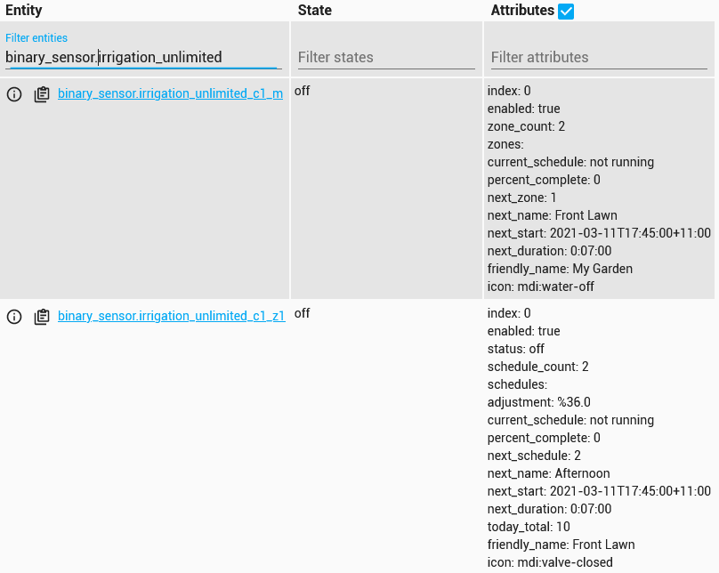

## 4. Installation

[HACS](https://hacs.xyz) is the recommended method for installation. If you are having difficulties then please see the _[troubleshooting guide](#11-troubleshooting)_

### 4.1. Install from HACS

1. Just search for Irrigation Unlimited integration in [HACS][hacs] and install it.
2. Add Irrigation Unlimited to your configuration.yaml file. See _[configuration examples](#6-configuration-examples)_ below.
3. Restart Home Assistant.

### 4.2. Manual installation

1. Using the tool of choice open the directory (folder) for your HA configuration (where you find `configuration.yaml`).
2. If you do not have a `custom_components` directory (folder) there, you need to create it.
3. In the `custom_components` directory (folder) create a new folder called `irrigation_unlimited`.
4. Download _all_ the files from the `custom_components/irrigation_unlimited/` directory (folder) in this repository.
5. Place the files you downloaded in the new directory (folder) you created.
6. Restart Home Assistant
7. In the HA UI go to "Configuration" -> "Integrations" click "+" and search for "Irrigation"

Using your HA configuration directory (folder) as a starting point you should now also have this:

```text
custom_components/irrigation_unlimited/__init__.py
custom_components/irrigation_unlimited/binary_sensor.py
custom_components/irrigation_unlimited/const.py
custom_components/irrigation_unlimited/entity.py
custom_components/irrigation_unlimited/history.py
custom_components/irrigation_unlimited/irrigation_unlimited.py
custom_components/irrigation_unlimited/manifest.json
custom_components/irrigation_unlimited/schema.py
custom_components/irrigation_unlimited/service.py
custom_components/irrigation_unlimited/services.yaml
```

## 5. Configuration

Configuration is done by yaml. Note: The configuration can be reloaded without restarting HA. See [below](#76-service-reload) for details and limitations.

| Name | Type | Default | Description |
| -----| ---- | ------- | ----------- |
| `controllers` | list | _[Controller Objects](#51-controller-objects)_ | Controller details (Must have at least one) |
| `granularity` | number | 60 | System time boundaries in seconds |
| `refresh_interval` | number | 30 | Refresh interval in seconds. When a controller or zone is on this value will govern how often the count down timers will update. Decrease this number for a more responsive display. Increase this number to conserve resources.
| `rename_entities` | bool | false | DANGER ZONE. Allow the sensor entity_id's to be altered. The [controller_id](#51-controller-objects) and [zone_id](#53-zone-objects) will be combined to form the new entity_id. Note: Automations, sensors, scripts, front end cards etc. may need to be updated to reflect the new entity_id's of the controllers and zones.
| `history_span` | number | 7 | Deprecated. See [history](#58-history-object) `span` |
| `history_refresh` | number | 120 | Deprecated. See [history](#58-history-object) `refresh_interval` |
| `history` | object | _[History Object](#58-history-object)_ | History data gathering options |
| `clock` | object | _[Clock Object](#59-clock-object)_ | Clock options |

### 5.1. Controller Objects

This is the controller or master object and manages a collection of zones. There must be at least one controller in the system. The controller state reflects the state of its zones. The controller will be on if any of its zones are on and off when all zones are off.

| Name | Type | Default | Description |
| ---- | ---- | ------- | ----------- |
| `zones` | list | _[Zone Objects](#53-zone-objects)_ | Zone details (Must have at least one) |
| `sequences` | list | _[Sequence Objects](#56-sequence-objects)_ | Sequence details |
| `name` | string | Controller _N_ | Friendly name for the controller |
| `controller_id` | string | _N_ | Controller reference. Used to change the default entity name (enable with [rename_entities](#5-configuration)). This must be in [snake_case](#13-snake-case) style with the exception the first character _can_ be a number |
| `enabled` | bool | true | Enable/disable the controller |
| `preamble` | [duration](#142-duration-time-period) | '00:00' | The time master turns on before any zone turns on. This is in effect a delay-start timer, controller will turn on before the zones. Can be negative to make the controller turn on _after_ the zone |
| `postamble` | [duration](#142-duration-time-period) | '00:00' | The time master remains on after all zones are off. This is in effect a run-on timer, controller will turn off after the specified delay. Can be negative to make the controller turn off _before_ the zone - this can reduce water hammering |
| `entity_id` | [switch_entity](#143-switch-entities) | | Switch entity_id(s) for example `switch.my_master_valve_1` |
| `all_zones_config` | object | _[All Zones Object](#52-all-zone-objects)_ | Shorthand default for all zones |
| `check_back` | object | | See _[Check Back Object](#510-check-back-object)_ |

### 5.2. All Zone Objects

This object is useful when the same settings are required for each zone. It is simply a shorthand or a more concise way to specify the same settings for each zone. The parameter becomes a default which can be overridden in the actual zone.

| Name | Type | Default | Description |
| ---- | ---- | ------- | ----------- |
| `minimum` | [duration](#142-duration-time-period) | | The minimum run time |
| `maximum` | [duration](#142-duration-time-period) | | The maximum run time |
| `duration` | [duration](#142-duration-time-period) | | The default run time |
| `future_span` | number | 3 | Run queue look ahead in days |
| `allow_manual` | bool | false | Allow manual run even when disabled |
| `show` | object | | See _[Zone Show Object](#54-zone-show-object)_ |
| `check_back` | object | | See _[Check Back Object](#510-check-back-object)_ |

### 5.3. Zone Objects

The zone object manages a collection of schedules. There must be at least one zone for each controller.

| Name | Type | Default | Description |
| ---- | ---- | ------- | ----------- |
| `schedules` | list | _[Schedule Objects](#55-schedule-objects)_ | Schedule details (Optional) |
| `zone_id` | string | _N_ | Zone reference. Used for sequencing and to rename the entity. This must be in [snake_case](#13-snake-case) style with the exception the first character _can_ be a number. Set [rename_entities](#5-configuration) to alter the entity _id of the sensor |
| `name` | string | Zone _N_ | Friendly name for the zone |
| `enabled` | bool | true | Enable/disable the zone |
| `minimum` | [duration](#142-duration-time-period) | '00:01' | The minimum run time |
| `maximum` | [duration](#142-duration-time-period) | | The maximum run time |
| `duration` | [duration](#142-duration-time-period) | | The default run time. Used when no `time` is provided for a manual run |
| `future_span` | number | 3 | Number of days to look ahead |
| `allow_manual` | bool | false | Allow manual run even when disabled |
| `entity_id` | [switch_entity](#143-switch-entities) | | Switch entity_id(s) for example `switch.my_zone_valve_1` |
| `show` | object | | See _[Zone Show Object](#54-zone-show-object)_ |
| `check_back` | object | | See _[Check Back Object](#510-check-back-object)_ |

### 5.4. Zone Show Object

These are various options to reveal attributes on the zone entity (only one for now).

| Name | Type | Default | Description |
| ---- | ---- | ------- | ----------- |
| `timeline` | bool | false | Show the zone timeline. This will expose an attribute called `timeline` on the zone entity |

### 5.5. Schedule Objects

Schedules are future events, _not_ dates for example Mondays at sunrise.

The schedule can have the commencement or completion fixed to a time or event with the `anchor` parameter. Any adjustments to the duration will alter the start time if `finish` is specified or the completion time if `start` is specified. Note: If anchoring to `finish` and the schedule can not complete before the specified time then the run will defer to the following day. This is an important consideration if adjusting run times dynamically as it may lead to a 'skipping' situation. Ensure there is sufficient time to complete the run when making adjustments. See _[here](#74-service-adjust_time)_ for more information on adjusting runs times.

The parameters `weekday`, `day` and `month` are date filters. If not specified then all dates qualify.

| Name | Type | Default | Description |
| ---- | ---- | ------- | ----------- |
| `time` | [time](#147-time-time-of-day)/_[Sun Event](#551-sun-event)_/_[Crontab](#552-crontab)_ | **Required** | The start time. Either a time (07:30), sun event or cron expression |
| `anchor` | string | start | `start` or `finish`. Sets the schedule to commence or complete at the specified time |
| `duration` | [duration](#142-duration-time-period) | | The length of time to run. Required for zones and optional for sequences |
| `name` | string | Schedule _N_ | Friendly name for the schedule |
| `weekday` | list | | The days of week to run [mon, tue...sun] |
| `day` | list/string/_[Every `n` days](#553-every-n-days)_ | | Days of month to run [1, 2...31]/odd/even/_[Every `n` days](#553-every-n-days)_ |
| `month` | list | | Months of year to run [jan, feb...dec] |
| `enabled` | bool | true | Enable/disable the schedule |
| `schedule_id` | string | | A unique identifier across all schedules. This must be in [snake_case](#13-snake-case) style. |

#### 5.5.1 Sun Event

Leave the time value in the _[Schedule Objects](#55-schedule-objects)_ blank and add the following object. An optional `before` or `after` time can be specified.

| Name | Type | Default | Description |
| ---- | ---- | ------- | ----------- |
| `sun` | string | **Required** | `sunrise` or `sunset` |
| `before` | [duration](#142-duration-time-period) | '00:00' | Time before the event |
| `after` | [duration](#142-duration-time-period) | '00:00' | Time after the event |

#### 5.5.2 Crontab

Leave the time value in the _[Schedule Objects](#55-schedule-objects)_ blank and add the following object.

| Name | Type | Default | Description |
| ---- | ---- | ------- | ----------- |
| `cron` | string | **Required** | A valid cron expression. Details can be found [here](https://github.com/josiahcarlson/parse-crontab) |

#### 5.5.3 Every `n` Days

Set the day value in the _[Schedule Objects](#55-schedule-objects)_ to a dictionary with the following keys.

| Name | Type | Default | Description |
| ---- | ---- | ------- | ----------- |
| `every_n_days` | number | **Required** | The interval between runs. |
| `start_n_days` | date | **Required** | The start date for the interval, you can alternate multiple schdules by offseting this by `every_n_days`. |

### 5.6. Sequence Objects

Sequences allow zones to run one at a time in a particular order with a delay in between. This is a type of watering 'playlist'. If a delay is specified and a pump or master valve is operated by the controller then consider the postamble setting in the _[Controller Object](#51-controller-objects)_. Set this to the largest delay to prevent pump on/off operations.

Sequences directly descend from a controller and are loosely connected to a zone entity via the `zone_id` parameter. The `zone_id` may point to one or many (a list) zone entities. A zone may be referenced more than once in a sequence.

```text
└── Irrigation Unlimited
      └──> Controller
            ├──> Zones
            │     ├──> Zone 1 <────┐
            │     ├──> Zone 2 <────┤
            │     │     ...        │
            │     └──> Zone N <────┤
            └──> Sequence          │
                  ├──> zone_id >───┤
                  ├──> zone_id >───┤
                  │      ...       │
                  └──> zone_id >───┘
```

| Name | Type | Default | Description |
| ---- | ---- | ------- | ----------- |
| `schedules` | list | _[Schedule Objects](#55-schedule-objects)_ | Schedule details (Optional). Note: `duration` if specified is the total run time for the sequence, see below for more details |
| `zones` | list | _[Sequence Zone Objects](#57-sequence-zone-objects)_ | Zone details (Must have at least one) |
| `delay` | [duration](#142-duration-time-period) | | Delay between zones. This value is a default for all _[Sequence Zone Objects](#57-sequence-zone-objects)_. Can be negative to make the next zone on _before_ the current zone has finished |
| `duration` | [duration](#142-duration-time-period) | | The length of time to run each zone. This value is a default for all _[Sequence Zone Objects](#57-sequence-zone-objects)_ |
| `repeat` | number | 1 | Number of times to repeat the sequence |
| `name` | string | Run _N_ | Friendly name for the sequence |
| `enabled` | bool | true | Enable/disable the sequence |

### 5.7. Sequence Zone Objects

The sequence zone is a reference to the actual zone defined in the _[Zone Objects](#53-zone-objects)_. Ensure the `zone_id`'s match between this object and the zone object. The zone may appear more than once in the case of a split run.

| Name | Type | Default | Description |
| ---- | ---- | ------- | ----------- |
| `zone_id` | string/list | **Required** | Zone reference. This must match the `zone_id` in the _[Zone Objects](#53-zone-objects)_ |
| `delay` | [duration](#142-duration-time-period) | | Delay between zones. This value will override the `delay` setting in the _[Sequence Objects](#56-sequence-objects)_ |
| `duration` | [duration](#142-duration-time-period) | | The length of time to run. This value will override the `duration` setting in the _[Sequence Objects](#56-sequence-objects)_. Can be negative to make the next zone on _before_ the current zone has finished. |
| `repeat` | number | 1 | Number of times to repeat this zone |
| `enabled` | bool | true | Enable/disable the sequence zone |

Special note for [schedules](#55-schedule-objects) and the `duration` parameter contained within when used with sequences. Each zone in the sequence will be proportionally adjusted to fit the specified duration. For example, if 3 zones were to each run for 10, 20 and 30 minutes respectively (total 1 hour) and the `schedule.duration` parameter specified 30 minutes then each zone would be adjusted to 5, 10 and 15 minutes. Likewise if `schedule.duration` specified 1.5 hours then the zones would be 15, 30 and 45 minutes. Some variation may occur due to rounding of the times to the system boundaries (granularity). This parameter influences the durations specified in the sequence and sequence zone objects.

### 5.8. History Object

The `timeline` and `total_today` attributes use history information. This information is read and cached by the history module.

| Name | Type | Default | Description |
| ---- | ---- | ------- | ----------- |
| `enabled` | bool | true | Enable/disable history |
| `span` | number | 7 | Number of days of history data to fetch |
| `refresh_interval` | number | 120 | History refresh interval in seconds |

#### 5.8.1. Long term statistics (LTS)

History is typically purged after 10 days. If you wish to retain the `total_today` data beyond this period then setup a Long-Term Statistic sensor. See [here](./packages/irrigation_unlimited_lts.yaml) for an example.
For more information see [Long-Term Statistics](https://data.home-assistant.io/docs/statistics/)

### 5.9. Clock Object

This object controls the internal clock mode.

| Name | Type | Default | Description |
| ---- | ---- | ------- | ----------- |
| `mode` | string | seer | `fixed` or `seer`. Set the clock to fixed (game loop) or seer (event loop) |
| `show_log` | bool | false | Expose the clock ticks via `next_tick` and `tick_log` attributes in the coordinator entity |
| `max_log_entiries` | number | 50 | Set the number of entires in the tick log history |

### 5.10. Check Back Object

This is used to check the state of the physical switch concurs with the state of the controller or zone. An out of sync can occur due to transmission or communications problems especially with protcols like WiFi, Zigbee or ZWave. The check back will report discrepancies and attempt to resync the switch. Should the resync fail a message will be logged and an [event](#1012-irrigation_unlimited_switch_error-irrigation_unlimited_sync_error) fired. The event can be use for notifications such as an email or phone alert. For more information see [Notifications](#10-notifications)

| Name | Type | Default | Description |
| ---- | ---- | ------- | ----------- |
| `state` | string | all | One of `none`, `all`, `on` or `off` |
| `delay` | number | 30 | Seconds to wait after switch is turned on or off |
| `retries` | number | 3 | Number of times to recheck the switch |
| `resync` | bool | true | Attempt to resync the switch |
| `state_on` | string | `on` | The value that represents the `on` state of the switch |
| `state_off` | string | `off` | The value that repesents the `off` state of the switch |

## 6. Configuration examples

### 6.1. Minimal configuration

```yaml
# Example configuration.yaml entry
irrigation_unlimited:
  controllers:
    zones:
      entity_id: "switch.my_switch"
      schedules:
        - time: "06:00"
          duration: "00:20"
```

### 6.2. Sun event example

```yaml
# Example configuration.yaml entry
# Run 20 minutes before sunrise for 30 minutes
irrigation_unlimited:
  controllers:
    zones:
      entity_id: "switch.my_switch_1"
      schedules:
        - name: "Before sunrise"
          time:
            sun: "sunrise"
            before: "00:20"
          duration: "00:30"
```

### 6.3. Sequence example

```yaml
# Example configuration.yaml entry
irrigation_unlimited:
  controllers:
    zones:
      - name: "Front lawn"
        entity_id: "switch.my_switch_1"
      - name: "Vege patch"
        entity_id: "switch.my_switch_2"
      - name: "Flower bed"
        entity_id: "switch.my_switch_3"
    sequences:
      - delay: "00:01"
        schedules:
          - name: "Sunrise"
            time:
              sun: "sunrise"
          - name: "After sunset"
            time:
              sun: "sunset"
              after: "00:30"
        zones:
          - zone_id: 1
            duration: "00:10"
          - zone_id: 2
            duration: "00:02"
          - zone_id: 3
            duration: "00:01"
```

### 6.4. Simple water saving / eco mode example

```yaml
# Example water saver. Run for 5 min on 2 off repeat 3 times
irrigation_unlimited:
  controllers:
    zones:
      - entity_id: "switch.my_switch_1"
    sequences:
      - duration: "00:05"
        delay: "00:02"
        repeat: 3
        schedules:
          - time: "05:00"
        zones:
          - zone_id: 1
```

### 6.5. Every hour on the hour

```yaml
# Example to run for 5 min every hour on the hour from 5am to 5pm
irrigation_unlimited:
  controllers:
    zones:
      - entity_id: "switch.my_switch_1"
    sequences:
      - name: "On the hour from 5am to 5pm"
        duration: "00:05"
        delay: "00:55"
        repeat: 12
        schedules:
          - time: "05:00"
        zones:
          - zone_id: 1
```

Similar to above but using the cron scheduler.

```yaml
# Example to run for 5 min every hour on the hour from 5am to 5pm
irrigation_unlimited:
  controllers:
    zones:
      - entity_id: "switch.my_switch_1"
    sequences:
      - name: "On the hour from 5am to 5pm"
        duration: "00:05"
        schedules:
          - time:
              cron: "0 5-17 * * *"
        zones:
          - zone_id: 1
```

### 6.6. Seasonal watering

```yaml
# Run 15 min 3 times a week in summer, 10 min once a week in winter and twice a week in spring/autumn
irrigation_unlimited:
  controllers:
    zones:
      - entity_id: "switch.my_switch_1"
        schedules:
          - time: "05:30"
            duration: "00:15"
            weekday: [mon, wed, fri]
            month: [dec, jan, feb]
          - time: "05:30"
            duration: "00:10"
            weekday: [sun]
            month: [jun, jul, aug]
          - time: "05:30"
            duration: "00:12"
            weekday: [mon, thu]
            month: [mar, apr, may, sep, oct, nov]
```

This is similar to the above but using sequences in a 3 zone system. Each zone runs for 12 minutes for a total of 36 min (plus delays). In Summer the total duration is extended to 45 minutes and winter reduced to 30 minutes. When using the `duration` parameter in the _[Schedule](#55-schedule-objects)_ it relates to the total duration of the sequence, each zone is adjusted accordingly.

```yaml
irrigation_unlimited:
  controllers:
    zones:
      - entity_id: "switch.my_switch_1"
      - entity_id: "switch.my_switch_2"
      - entity_id: "switch.my_switch_3"
    sequences:
      - name: "Run 1"
        duration: "00:12"
        delay: "00:01"
        schedules:
          - name: "Summer"
            time: "05:30"
            weekday: [mon, wed, fri]
            month: [dec, jan, feb]
            duration: "00:45"
          - name: "Winter"
            time: "05:30"
            weekday: [sun]
            month: [jun, jul, aug]
            duration: "00:30"
          - name: "Spring and Autumn"
            time: "05:30"
            weekday: [mon, thu]
            month: [mar, apr, may, sep, oct, nov]
        zones:
          - zone_id: 1
          - zone_id: 2
          - zone_id: 3
```

Just in case this does not go far enough then create three sequences with one schedule each. This will allow _complete_ control over _all_ aspects of the sequence including which zones to run, order, durations, delays, repeats etc. Still want more then create a sequence for each month of the year. This example reverses the order in Spring/Autumn for no good reason and excludes a zone in Winter.

```yaml
irrigation_unlimited:
  controllers:
    zones:
      - entity_id: "switch.my_switch_1"
      - entity_id: "switch.my_switch_2"
      - entity_id: "switch.my_switch_3"
    sequences:
      - name: "Summer"
        duration: "00:15"
        delay: "00:01"
        schedules:
          - time: "05:30"
            weekday: [mon, wed, fri]
            month: [dec, jan, feb]
        zones:
          - zone_id: 1
          - zone_id: 2
          - zone_id: 3
      - name: "Winter"
        duration: "00:10"
        delay: "00:01"
        schedules:
          - time: "07:30"
            weekday: [sun]
            month: [jun, jul, aug]
        zones:
          - zone_id: 1
          - zone_id: 3
      - name: "Spring and Autumn"
        duration: "00:12"
        delay: "00:01"
        schedules:
          - time: "06:30"
            weekday: [mon, thu]
            month: [mar, apr, may, sep, oct, nov]
        zones:
          - zone_id: 3
          - zone_id: 2
          - zone_id: 1
```

### 6.7. Finish at sunrise

```yaml
# Finish a watering run 10 minutes before sunrise
irrigation_unlimited:
  controllers:
    zones:
      - entity_id: "switch.my_switch_1"
      - entity_id: "switch.my_switch_2"
      - entity_id: "switch.my_switch_3"
      - entity_id: "switch.my_switch_4"
    sequences:
      - name: "My watering run"
        duration: "00:30"
        delay: "00:01"
        schedules:
          - name: "Before dawn"
            time:
              sun: "sunrise"
              before: "00:10"
            anchor: finish
        zones:
          - zone_id: 1
          - zone_id: 2
          - zone_id: 3
          - zone_id: 4
```

For a more comprehensive example refer to [here](./examples/all_the_bells_and_whistles.yaml).

### 6.8. Tips

1. Schedules can not only have a day of week (mon, wed, fri) but also a month of year (jan, feb, mar). This allows the setup of seasonal watering schedules. For example run every day in summer and twice a week in winter. Setup a different schedule for each month of the year using this filter.

2. Use sequences to setup a water saving or eco mode. Eco mode uses small cycles with a delay to allow the water to soak in and minimise run off. Run all the zones for half the time and then repeat.

3. No need to restart HA after changing the configuration.yaml file. Go to Configuration -> Server Controls -> YAML configuration and reloading and press 'RELOAD IRRIGATION UNLIMITED'.

4. After setting up configuration.yaml, the operation can be controlled via service calls as shown _[below](#7-services)_. Perform manual runs, adjust watering times, cancel running schedules and enable/disable zones from a _[frontend](#8-frontend)_

## 7. Services

The binary sensor associated with each controller and zone provide several services. These sensors offer the following services:

- `enable`
- `disable`
- `toggle`
- `suspend`
- `cancel`
- `manual_run`
- `adjust_time`
- `load_schedule`

If a controller sensor is targetted then it will effect all its children zones.

### 7.1. Services `enable`, `disable` and `toggle`

Enables/disables/toggles the controller, zone, sequence or sequence zone respectively.

| Service data attribute | Type | Required | Description |
| ---------------------- | ---- | -------- | ----------- |
| `entity_id` | [string/list](#141-irrigation-unlimited-entities) | yes | Controller or zone to enable/disable/toggle. |
| `sequence_id` | [number](#145-sequence) | no | Sequence to enable/disable/toggle. |
| `zones` | [number/list](#146-zones) | no | Sequence zones to enable/disable/toggle. |

### 7.2. Service `suspend`

NOTE: Available from release 2023.9.0.

Suspend operation of a controller, zone, sequence or sequence zone for a period of time. This is like a temporary `disable` that will automatically reset.

| Service data attribute | Type | Required | Description |
| ---------------------- | ---- | -------- | ----------- |
| `entity_id` | [string/list](#141-irrigation-unlimited-entities) | yes | Controller or zone to run. |
| `sequence_id` | [number](#145-sequence) | no | Sequence to enable/disable/toggle. |
| `zones` | [number/list](#146-zones) | no | Sequence zones to enable/disable/toggle. |
| `for` | [duration](#142-duration-time-period) | see below* | Suspend for a period of time. Supports [templating](#144-templating). |
| `until` | string | see below* | Suspend until a point in time. Format is `%Y-%m-%d %H:%M:%S` for example `2023-08-01 07:30:00`. |
| `reset` | none | see below* | Reset or cancel the current suspension. |

\* Must have one and only one of `for`, `until` or `reset`.

### 7.3. Service `cancel`

Cancels the current running schedule.

| Service data attribute | Type | Required | Description |
| ---------------------- | ---- | -------- | ----------- |
| `entity_id` | [string/list](#141-irrigation-unlimited-entities) | yes | Controller or zone to cancel. |

### 7.4. Service `manual_run`

Turn on the controller or zone for a period of time. When a sequence is specified each zone's duration will be auto adjusted as a proportion of the original sequence. Zone times are calculated and rounded to the nearest time boundary. This means the total run time may vary from the specified time.

| Service data attribute | Type | Required | Description |
| ---------------------- | ---- | -------- | ----------- |
| `entity_id` | [string/list](#141-irrigation-unlimited-entities) | yes | Controller or zone to run. |
| `time` | [duration](#142-duration-time-period) | no | Total time to run. Supports [templating](#144-templating). If not provided or is "0:00:00" then adjusted defaults will be applied |
| `sequence_id` | [number](#145-sequence) | no | Sequence to run. Each zone duration will be adjusted to fit the allocated time, delays are not effected. Note: The time parameter _includes_ inter zone delays. If the total delays are greater than the specified time then the sequence will not run. |

### 7.5. Service `adjust_time`

Adjust the run times. Calling this service will override any previous adjustment i.e. it will _not_ make adjustments on adjustments. For example, if the scheduled duration is 30 minutes calling percent: 150 will make it 45 minutes then calling percent 200 will make it 60 minutes. When a sequence is specified each zone's duration will be auto adjusted as a proportion of the original sequence.

A schedule anchored to a start time will alter the completion time. Likewise a schedule anchored to a finish time will change the commencement time. In this situation ensure there is enough time in the current day for the schedule to complete or it will be deferred to the following day. Adjustments must be made _before_ the scheduled start time. Running schedules will be not affected.

Tip: Use forecast and observation data collected by weather integrations in automations to adjust the run times. See [below](#9-automation) for more information.

| Service data attribute | Type | Required | Description |
| ---------------------- | ---- | -------- | ----------- |
| `entity_id` | [string/list](#141-irrigation-unlimited-entities) | yes | Controller or zone to run. |
| `actual` | [duration](#142-duration-time-period) | see below* | Specify a new run time. This will replace the existing duration. Supports [templating](#144-templating). |
| `percentage` | float | see below* | Adjust time by a percentage. Values less than 100 will decrease the run time while values greater than 100 will increase the run time. Supports [templating](#144-templating). |
| `increase` | [duration](#142-duration-time-period) | see below* | Increase the run time by the specified time. A value of '00:10' will increase the duration by 10 minutes. Value will be capped by the `maximum` setting. Supports [templating](#144-templating). |
| `decrease` | [duration](#142-duration-time-period) | see below* | Decrease the run time by the specified time. A value of '00:05' will decrease the run time by 5 minutes. Value will be limited by the `minimum` setting. Supports [templating](#144-templating). |
| `reset` | none | see below* | Reset adjustment back to the original schedule time (Does not effect minimum or maximum settings). |
| `minimum` | [duration](#142-duration-time-period) | no | Set the minimum run time. Supports [templating](#144-templating). |
| `maximum` | [duration](#142-duration-time-period) | no | Set the maximum run time. Note: The default is no limit. Supports [templating](#144-templating). |
| `sequence_id` | [number](#145-sequence) | no | Sequence to adjust. |
| `zones` | [number/list](#146-zones) | no | Zones to adjust. |

\* Must have one and only one of `actual`, `percentage`, `increase`, `decrease` or `reset`.

### 7.6. Service `load_schedule`

Reload a schedule. This will allow an edit to an existing schedule. All fields are optional except the `schedule_id`. If a field is specified then it is overwritten otherwise it is left untouched.

| Name | Type | Default | Description |
| ---- | ---- | ------- | ----------- |
| `schedule_id` | string | **Required** | The unique schedule identifier. The target [schedule](#55-schedule-objects) must have the unique `schedule_id` set |
| `time` | [time](#147-time-time-of-day)/_[Sun Event](#551-sun-event)_/_[Crontab](#552-crontab)_ | | The start time. Either a time (07:30), sun event or cron expression |
| `anchor` | string | | `start` or `finish`. Sets the schedule to commence or complete at the specified time |
| `duration` | [duration](#142-duration-time-period) | | The length of time to run. Required for zones and optional for sequences |
| `name` | string | | Friendly name for the schedule |
| `weekday` | list | | The days of week to run [mon, tue...sun] |
| `day` | list/string/_[Every `n` days](#553-every-n-days)_ | | Days of month to run [1, 2...31]/odd/even/_[Every `n` days](#553-every-n-days)_ |
| `month` | list | | Months of year to run [jan, feb...dec] |
| `enabled` | bool | | Enable/disable the schedule |

### 7.7. Service `reload`

Reload the YAML configuration file. Do not add or delete controllers or zones, they will not work because of the associated entities which are created on startup. This may be addressed in a future release, however, suggested work around is to set enabled to false to effectively disable/delete. All other settings can be changed including schedules. You will find the control in Configuration -> Server Controls -> YAML configuration reloading. Note: since version 2021.10.0 all settings can be changed including new controllers and zones.

### 7.8. Service call access roadmap

A reminder that sequences directly descend from a controller. Therefore service calls that manipulate a sequence should address the parent controller. An entity_id of a zone when trying to adjust a sequence will most likely not have the desired effect.

The combination of three key parameters `entity_id`, `sequence_id` and `zones` will target the various sections of the configuration.

- `entity_id:` This will be either the controller or zone entity.
- `sequence_id:` This is the position number of the sequence under the controller. `sequence_id: 1` is the first, 2 is the second and so on. As a shortcut, `sequence_id` will alter _all_ sequences.
- `zones:` This is the position number of the zone reference under the sequence. `zones: 1` is the first, 2 is the second and so on. As a shortcut, `zones: 0` will alter _all_ zone references in the sequence. May also take a list `zones: [1,3,5]`

The following is a valid irrigation unlimited configuration. It shows how various points can be changed using the service calls above. Example numbers have the nomenclature C.Z.S.R = Controller.Zone.Sequence.zoneReference. If Z is zero then the `entity_id` must be the controller/master i.e. binary_sensor.irrigation_unlimited_cN_m. If Z is not zero then then entity_id is the zone i.e. binary_sensor.irrigation_unlimited_cN_zN.

```yaml
irrigation_unlimited:
  controllers:
    - name: "Controller 1"
      enabled: true # <= See example 1.0
      zones:
        - name: "Controller 1, Zone 1"
          enabled: true # <= See example 1.1
          - schedules:
              - time: "04:00"
                duration: "00:10" # <= See example 1.1.1
        - name: "Controller 1, Zone 2"
          enabled: true # <= See example 1.2
          - schedules:
              - time: "05:00"
                duration: "00:10" # <= See example 1.2.1
      sequences:
        - name: "Controller 1, Sequence 1"
          enabled: true # <= See example 1.0.1e
          schedules:
            - time: "06:00"
              duration: "01:00" # <= See example 1.0.1
          zones:
            - zone_id: [1, 2] # This is controller 1, sequence 1, zone reference 1
              enabled: true # <= See example 1.0.1.1e
              duration: "00:10" # <= See example 1.0.1.1
            - zone_id: 2  # This is controller 1, sequence 1, zone reference 2
              enabled: true # <= See example 1.0.1.2e
              duration: "00:10" # <= See example 1.0.1.2
        - name: "Controller 1, Sequence 2"
          enabled: true # <= See example 1.0.2e
          schedules:
            - time: "07:00"
              duration: "01:00" # <= See example 1.0.2
          zones:
            - zone_id: 1 # This is controller 1, sequence 2, zone reference 1
              enabled: true # <= See example 1.0.2.1e
              duration: "00:10" # <= See example 1.0.2.1
    - name: "Controller 2"
      enabled: true # <= See example 2.0
      zones:
        - name: "Controller 2, Zone 1"
          enabled: true # <= See example 2.1
        - name: "Controller 2, Zone 2"
          enabled: true # <= See example 2.2
      sequences:
        - name: "Controller 2, Sequence 1"
          enabled: true # <= See example 2.0.1e
          schedules:
            - time: "09:00"
              duration: "01:00" # <= See example 2.0.1
          zones:
            - zone_id: 1 # This is controller 2, sequence 1, zone reference 1
              enabled: true # <= See example 2.0.1.1e
              duration: "00:10" # <= See example 2.0.1.1
            - zone_id: 2 # This is controller 2, sequence 1, zone reference 2
              enabled: true # <= See example 2.0.1.2e
              duration: "00:10" # <= See example 2.0.1.2
        - name: "Controller 2, Sequence 2"
          enabled: true # <= See example 2.0.2e
          schedules:
            - time: "09:00"
              duration: "01:00" # <= See example 2.0.2
          zones:
            - zone_id: 1 # This is controller 2, sequence 2, zone reference 1
              enabled: true # <= See example 2.0.2.1e
              duration: "00:10" # <= See example 2.0.2.1
            - zone_id: 2 # This is controller 2, sequence 2, zone reference 2
              enabled: true # <= See example 2.0.2.2e
              duration: "00:10" # <= See example 2.0.2.2
```

Notes:

1. The `adjust_time` service call examples show the adjustment method of `actual`. This is shown for simplicity however all methods are available as described _[above](#74-service-adjust_time)_.
2. The `enable` service call can also be `disable` or `toggle`.

```yaml
# Example 1.0 -> controller 1 -> enabled. This will alter the enabled status for the controller.
- service: irrigation_unlimited.enable
  data:
    entity_id: binary_sensor.irrigation_unlimited_c1_m

# Example 1.1 -> controller 1 -> zone 1 -> enabled. This will alter the enabled status for zone 1.
- service: irrigation_unlimited.enable
  data:
    entity_id: binary_sensor.irrigation_unlimited_c1_z1

# Example 1.1.1 -> controller 1 -> zone 1 -> duration. This will alter the duration for zone 1.
- service: irrigation_unlimited.adjust_time
  data:
    entity_id: binary_sensor.irrigation_unlimited_c1_z1
    actual: "00:20"

# Example 1.2 -> controller 1 -> zone 2 -> enabled. This will alter the enabled status of zone 2.
- service: irrigation_unlimited.enable
  data:
    entity_id: binary_sensor.irrigation_unlimited_c1_z2

# Example 1.2.1 -> controller 1 -> zone 1 -> duration. This will alter the duration for zone 2.
- service: irrigation_unlimited.adjust_time
  data:
    entity_id: binary_sensor.irrigation_unlimited_c1_z2
    actual: "00:20"

# Example 1.0.1e -> controller 1 -> sequence 1 -> enabled. This will alter the enabled status of sequence 1.
- service: irrigation_unlimited.enable
  data:
    entity_id: binary_sensor.irrigation_unlimited_c1_m
    sequence_id: 1

# Example 1.0.1 -> controller 1 -> sequence 1 -> duration. This will proportionally alter the duration
# for all zone references in the first sequence.
- service: irrigation_unlimited.adjust_time
  data:
    entity_id: binary_sensor.irrigation_unlimited_c1_m
    sequence_id: 1
    actual: "00:20"

# Example 1.0.1.1e -> controller 1 -> sequence 1 -> zone reference 1 -> enabled. This will alter the enabled
# status of the first zone reference in the first sequence.
- service: irrigation_unlimited.enable
  data:
    entity_id: binary_sensor.irrigation_unlimited_c1_m
    sequence_id: 1
    zones: 1

# Example 1.0.1.1 -> controller 1 -> sequence 1 -> zone reference 1 -> duration. This will alter the duration
# for the first zone reference in the first sequence.
- service: irrigation_unlimited.adjust_time
  data:
    entity_id: binary_sensor.irrigation_unlimited_c1_m
    sequence_id: 1
    zones: 1
    actual: "00:20"

# Example 1.0.1.2 - controller 1 -> sequence 1 -> zone reference 2 -> enabled. This will alter the enabled
# status of the second zone reference in the first sequence.
- service: irrigation_unlimited.enable
  data:
    entity_id: binary_sensor.irrigation_unlimited_c1_m
    sequence_id: 1
    zones: 2

# Example 1.0.1.2 - controller 1 -> sequence 1 -> zone reference 2 -> duration. This will alter the duration
# for the second zone reference in the first sequence.
- service: irrigation_unlimited.adjust_time
  data:
    entity_id: binary_sensor.irrigation_unlimited_c1_m
    sequence_id: 1
    zones: 2
    actual: "00:20"

# Example 1.0.2e - controller 1 -> sequence 2 -> enabled. This will alter the enabled
# status of the second sequence.
- service: irrigation_unlimited.enabled
  data:
    entity_id: binary_sensor.irrigation_unlimited_c1_m
    sequence_id: 2

# Example 1.0.2 - controller 1 -> sequence 2 -> duration. This will proportionally alter the duration
# for all zone references in the second sequence.
- service: irrigation_unlimited.adjust_time
  data:
    entity_id: binary_sensor.irrigation_unlimited_c1_m
    sequence_id: 2
    actual: "00:20"

# Example 1.0.2.1e - controller 1 -> sequence 2 -> zone reference 1 -> enabled
- service: irrigation_unlimited.enable
  data:
    entity_id: binary_sensor.irrigation_unlimited_c1_m
    sequence_id: 2
    zones: 1

# Example 1.0.2.1 - controller 1 -> sequence 2 -> zone reference 1 -> duration
- service: irrigation_unlimited.adjust_time
  data:
    entity_id: binary_sensor.irrigation_unlimited_c1_m
    sequence_id: 2
    zones: 1
    actual: "00:20"

# Example 2.0 -> controller 2 -> enabled. This will alter the enabled status for the controller.
- service: irrigation_unlimited.enable
  data:
    entity_id: binary_sensor.irrigation_unlimited_c2_m

# Example 2.1 -> controller 2 -> zone 1 -> enabled. This will alter the enabled status for zone 1.
- service: irrigation_unlimited.enable
  data:
    entity_id: binary_sensor.irrigation_unlimited_c2_z1

# Example 2.2 -> controller 2 -> zone 2 -> enabled. This will alter the enabled status of zone 2.
- service: irrigation_unlimited.enable
  data:
    entity_id: binary_sensor.irrigation_unlimited_c2_z2

# Example 2.0.1e - controller 2 -> sequence 1 -> enabled. This will alter the enabled status
# for the first sequence.
- service: irrigation_unlimited.enable
  data:
    entity_id: binary_sensor.irrigation_unlimited_c2_m
    sequence_id: 1

# Example 2.0.1 - controller 2 -> sequence 1 -> duration. This will proportionally alter the duration
# for all zone references in the first sequence.
- service: irrigation_unlimited.adjust_time
  data:
    entity_id: binary_sensor.irrigation_unlimited_c2_m
    sequence_id: 1
    actual: "00:20"

# Example 2.0.1.1e - controller 2 -> sequence 1 -> zone reference 1 -> enabled. This will alter the enabled
# status for the first zone reference in the first sequence.
- service: irrigation_unlimited.enable
  data:
    entity_id: binary_sensor.irrigation_unlimited_c2_m
    sequence_id: 1
    zones: 1

# Example 2.0.1.1 - controller 2 -> sequence 1 -> zone reference 1 -> duration. This will alter the duration
# for the first zone reference in the first sequence.
- service: irrigation_unlimited.adjust_time
  data:
    entity_id: binary_sensor.irrigation_unlimited_c2_m
    sequence_id: 1
    zones: 1
    actual: "00:20"

# Example 2.0.1.2e - controller 2 -> sequence 1 -> zone reference 2 -> enabled. This will alter the enabled
# status for the second zone reference in the first sequence.
- service: irrigation_unlimited.enable
  data:
    entity_id: binary_sensor.irrigation_unlimited_c2_m
    sequence_id: 1
    zones: 2

# Example 2.0.1.2 - controller 2 -> sequence 1 -> zone reference 2 -> duration. This will alter the duration
# for the second zone reference in the first sequence.
- service: irrigation_unlimited.adjust_time
  data:
    entity_id: binary_sensor.irrigation_unlimited_c2_m
    sequence_id: 1
    zones: 2
    actual: "00:20"

# Example 2.0.2e - controller 2 -> sequence 2 -> enabled
- service: irrigation_unlimited.enable
  data:
    entity_id: binary_sensor.irrigation_unlimited_c2_m
    sequence_id: 2

# Example 2.0.2 - controller 2 -> sequence 2 -> duration
- service: irrigation_unlimited.adjust_time
  data:
    entity_id: binary_sensor.irrigation_unlimited_c2_m
    sequence_id: 2
    actual: "00:20"

# Example 2.0.2.1e - controller 2 -> sequence 2 -> zone reference 1 -> enabled
- service: irrigation_unlimited.enable
  data:
    entity_id: binary_sensor.irrigation_unlimited_c2_m
    sequence_id: 2
    zones: 1

# Example 2.0.2.2 - controller 2 -> sequence 2 -> zone reference 1 -> duration
- service: irrigation_unlimited.adjust_time
  data:
    entity_id: binary_sensor.irrigation_unlimited_c2_m
    sequence_id: 2
    zones: 1
    actual: "00:20"

# Example 2.0.2.2e - controller 2 -> sequence 2 -> zone reference 2 -> enabled
- service: irrigation_unlimited.enable
  data:
    entity_id: binary_sensor.irrigation_unlimited_c2_m
    sequence_id: 2
    zones: 2

# Example 2.0.2.2 - controller 2 -> sequence 2 -> zone reference 2 -> duration
- service: irrigation_unlimited.adjust_time
  data:
    entity_id: binary_sensor.irrigation_unlimited_c2_m
    sequence_id: 2
    zones: 2
    actual: "00:20"
```

## 8. Frontend

From release 2022.4.0 a [companion card](https://github.com/rgc99/irrigation-unlimited-card) is available.

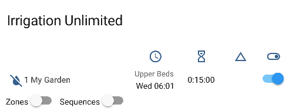

and expands to

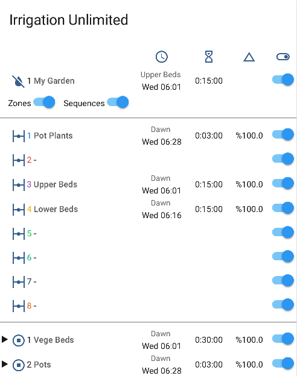

### 8.1. Generic Cards

Most of the following will require installation of further [lovelace cards](https://www.home-assistant.io/lovelace/). For some inspiration and a compact card try [this](./lovelace/card.yaml).

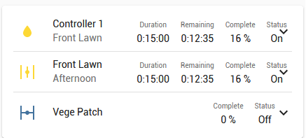

and it expands to:

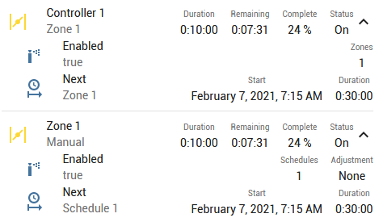

Note: This card uses some custom cards [multiple-entity-row](https://github.com/benct/lovelace-multiple-entity-row), [fold-entity-row](https://github.com/thomasloven/lovelace-fold-entity-row), [logbook-card](https://github.com/royto/logbook-card) and at the moment [card-mod](https://github.com/thomasloven/lovelace-card-mod) for styles.

For watering history information here is a [sample card](./lovelace/watering_history_card.yaml).

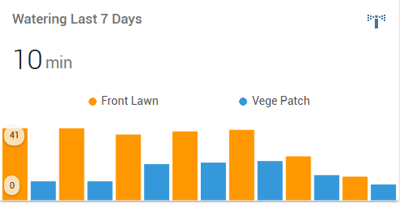.

Note: At time of writing this requires a pre-released version of [mini-graph-card](https://github.com/kalkih/mini-graph-card/releases/tag/v0.11.0-dev.3). Note: If you get "NaN" displayed instead of the actual value then clear out your browsers cache and make sure the development release is installed.

Although not really part of the integration but to get you started quickly here is a [temperature card](./lovelace/temperature_card.yaml).

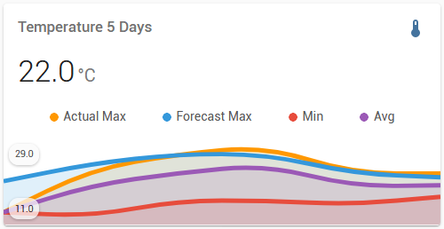.

And a [rainfall card](./lovelace/rainfall_card.yaml). Note how the watering times reduced as rainfall started. More on this below in [Automation](#9-automation).

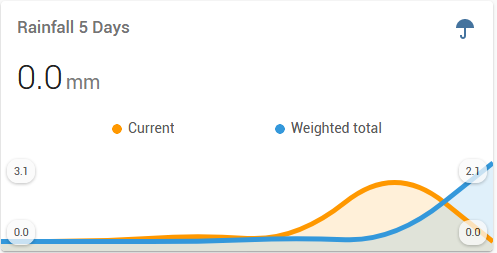

Finally, a system event [log](./lovelace/system_history_card.yaml)

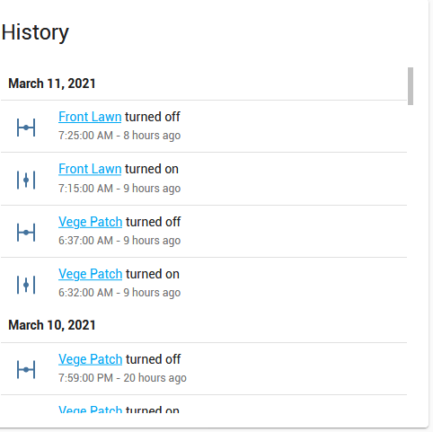

Putting it all together, here is the [complete picture](./lovelace/my_dashboard.yaml)

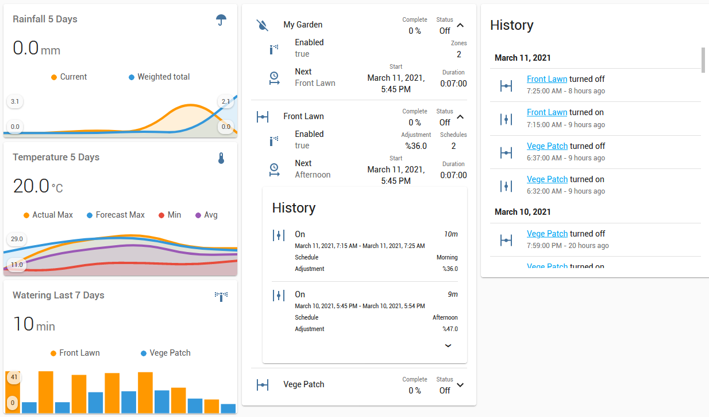

This configuration is three vertical stacks and works well on mobile devices.

### 8.2. Timeline

Minimum version 2021.12.0 of Irrigation Unlimited is required for this feature. First up, enable the timeline in the [zone show object](#54-zone-show-object).

```yaml
irrigation_unlimited:
  controllers:
    all_zones_config: # <= Add these three lines <─┐
      show: # <= to the configuration            <─┤
        timeline: true # <= for all zones        <─┘
    zones:
      entity_id: "switch.my_switch"
      show: # <= Add these two lines to the                    <─┐
        timeline: true # <= configuration for individual zones <─┘
      schedules:
        - time: "06:00"
          duration: "00:20"
```

Like the watering history card above it also shows the upcoming schedule for a complete overview of your irrigation. Find the code [here](./lovelace/timeline_chart.yaml). Requires [apexcharts-card](https://github.com/RomRider/apexcharts-card).

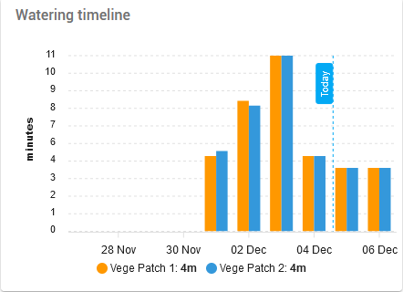

If you prefer something akin to a airport departure board then try [this](./lovelace/timeline_card.yaml). Uses Markdown card which is built into Home Assistant so will work straight out of the box.

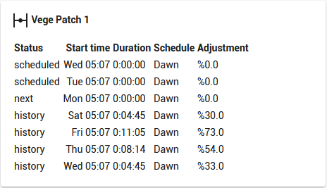

### 8.3. Frontend Requirements

The [manual_run](#84-manual-run-card) and [enable/disable](#85-enable-disable-card) cards require additional support files. Minimum version 2021.6.3 of Irrigation Unlimited is required. There is a support file [packages/irrigation_unlimited_controls.yaml](./packages/irrigation_unlimited_controls.yaml) which should go in the config/packages directory. Also required is a [pyscript](./pyscript/irrigation_unlimited_service_shim.py) which is called from the above automation to populate the input_select with all the irrigation unlimited controllers and zones. The script should go in the **config/pyscript directory**. If you don't have a packages and a pyscript folder then create them and add the following to your configuration.yaml.

```yaml
homeassistant:
  packages: !include_dir_named packages
```

Using your HA configuration directory (folder) as a starting point you should now also have this:

```text
pyscript/irrigation_unlimited_service_shim.py
packages/irrigation_unlimited_controls.yaml
```

More information on packages can be found [here](https://www.home-assistant.io/docs/configuration/packages) and pyscript can be found [here](https://github.com/custom-components/pyscript), don't worry about the Jupyter kernel unless you are really keen. Hint: A pyscript is used instead of Jinja2 as it produces a list which Jinja2 is not capable of, many have tried... The pyscript is a small piece of code that convert for example ‘1.1 Zone1’ inside an input_select control into ‘binary_sensor.irrigation_unlimited_c1_z1’ and then call the actual service. They are just helpers sitting between the lovelace card and the integration. It's a great way to add some additional capabilities to lovelace cards.

### 8.4. Manual run card

Here is a card for manual runs, see [requirements](#83-frontend-requirements) above. You can find the code [here](./lovelace/card_manual_run.yaml). Note: This card uses [paper-buttons-row](https://github.com/jcwillox/lovelace-paper-buttons-row) and [time-picker-card](https://github.com/GeorgeSG/lovelace-time-picker-card).

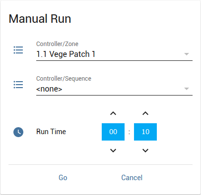

### 8.5. Enable-disable card

This card will enable or disable a zone from a dropdown list, see [requirements](#83-frontend-requirements) above. The code is [here](./lovelace/card_enable_disable.yaml). Like the manual run card it requires [paper-buttons-row](https://github.com/jcwillox/lovelace-paper-buttons-row).

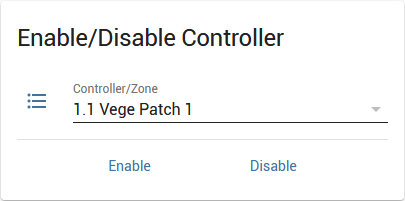

## 9. Automation

Due to the many weather integrations available and their relevance to your situation, there is realistically no way to provide a built in 'auto-adjustment' feature. Therefore, no attempt has been made to include a solution and this also makes the integration more independent and flexible. Run time adjustment is achieved by setting up sensor(s) that consume weather information such as rainfall and temperature but could factor in wind speed, solar radiation etc. to determine if more or less watering time is required. You might also consider using forecast information... A service call is then made to irrigation unlimited to adjust the run times. This does mean some knowledge of creating automations is required.

On a personal note, I use the national weather service [BOM](http://www.bom.gov.au) for my forecast information but find their observation data not relevant due to the extreme regional variations in my situation. There are many micro climates (mountains) and a few kilometres in any direction makes a lot of difference, down pour to a few drops. To this end I have a Personal Weather Station (PWS) that feeds [Weather Underground](https://www.wunderground.com) where I use the [WUnderground](https://www.home-assistant.io/integrations/wunderground) integration to retrieve the data.

You will find my adjustment automation [here](./packages/irrigation_unlimited_adjustment.yaml) which feeds off the temperature and rainfall observation data. There is a card [here](./lovelace/observations_card.yaml) which displays this information (uses [multiple-entity-row](https://github.com/benct/lovelace-multiple-entity-row)). Some ideas were gleaned from [kloggy's](https://github.com/kloggy/HA-Irrigation-Version2) work.

### 9.1. ESPHome

This example uses the data from a soil moisture probe created in [ESPHome](https://esphome.io/) to adjust the run times.

```yaml
automation:
  - alias: ESPHome soil moisture adjustment
    trigger:
      platform: state
      entity_id:
        - sensor.yard1_humidity
    action:
      service: irrigation_unlimited.adjust_time
      data:
        entity_id: binary_sensor.irrigation_unlimited_c1_m
        percentage: >
          {# Threshold variable 0-100 percent #}
          

          {# Sensor data #}
          

          
            {# Option 1 - A linear sliding scale #}
            
            {# Option 2 - On or Off #}
            
          
             {# It's too wet, turn off #}
          

          {# Return multiplier as a percentage #}
          {{ (multiplier * 100) | round(0) }}
```

### 9.2. HAsmartirrigation

[HAsmartirrigation](https://github.com/jeroenterheerdt/HAsmartirrigation) calculates the time to run your irrigation system to compensate for moisture lost by evaporation / evapotranspiration. The following automation runs at 23:30 and takes the calculated run time from HAsmartirrigation and updates Irrigation Unlimited with the new watering time. It then calls HAsmartirrigation to reset the bucket when the irrigation has run.

The example below offers two methods for a single zone or a sequence.

```yaml
# Example automation for HAsmartirrigation integration (smart_irrigation)[https://github.com/jeroenterheerdt/HAsmartirrigation]
automation:
  - id: 'IU1653097957047'
    alias: Smart Irrigation adjustment
    description: Adjust watering times based on smart irrigation calculations
    trigger:
      - platform: time
        at: "23:30"
    condition:
      condition: and
      conditions:
        - "{{ states('sensor.smart_irrigation_daily_adjusted_run_time') | float(-1) >= 0 }}"
    action:
      - service: irrigation_unlimited.adjust_time
        data:
          actual: "{{ timedelta(seconds=states('sensor.smart_irrigation_daily_adjusted_run_time') | int(0)) }}"
          # -------------------------------------------------------------------
          # Please see documentation regarding the adjust_time service call.
          # Choose an option below. Comment out/delete as needed. This will NOT work as is.
          # 1. Adjust a single zone. Change the zone as required
          # entity_id: binary_sensor.irrigation_unlimited_c1_z1
          # 2. Adjust a sequence. Change the sequence_id as required
          # entity_id: binary_sensor.irrigation_unlimited_c1_m
          # sequence_id: 1
          # -------------------------------------------------------------------
    mode: single

  - id: 'IU1653098247170'
    alias: Smart Irrigation reset bucket
    description: Resets the Smart Irrigation bucket after watering
    trigger:
      - platform: state
        entity_id:
          # Add Irrigation Unlimited sensors here
          - binary_sensor.irrigation_unlimited_c1_m
        from: "on"
        to: "off"
    condition:
      - condition: numeric_state
        above: '0'
        entity_id: sensor.smart_irrigation_daily_adjusted_run_time
    action:
      - service: smart_irrigation.smart_irrigation_reset_bucket
```

### 9.3. Overnight watering

Run from sunset to sunrise. This automation will run 1 hour before sunset. It uses the sun integration to calculate the duration from sunset to sunrise and then set this via the adjust_time service call. Create a schedule that starts at sunset and just put in a nominal duration. The duration will be replaced by the service call. Please take note of the comments in the automation as you must change it to suit your configuration.

```yaml
automation:
  - id: 'IU1655789912900'
    alias: IU Overnight
    description: Run irrigation from sunset to sunrise
    trigger:
      - platform: sun
        event: sunset
        offset: -00:60:00
    condition: []
    action:
      service: irrigation_unlimited.adjust_time
      data:
        # -------------------------------------------------------------------
        # Please see documentation regarding the adjust_time service call.
        # Choose an option below. Comment out/delete/change as needed.
        # *** This will NOT work as is. ***
        # 1. Adjust a single zone. Change the zone as required
        # entity_id: binary_sensor.irrigation_unlimited_c1_z1
        # 2. Adjust a sequence. Change the sequence_id as required
        # entity_id: binary_sensor.irrigation_unlimited_c1_m
        # sequence_id: 1
        # -------------------------------------------------------------------
        actual: >
          
          
          {{ t2 - t1 }}
    mode: single
```

## 10. Notifications

This section shows how to send a notification when a sequence starts or finishes. Messages can be sent for example via email (SMTP), push notification to mobile phones, twitter and many [others](https://www.home-assistant.io/integrations/#notifications). See [here](https://www.home-assistant.io/integrations/notify/) for more information on notifications in Home Assistant. Note that it is not limited to sending notifications but many other [actions](https://www.home-assistant.io/docs/automation/action/) are available. There is quite a lot of information on using notifications in Home Assistant on the web. Try Google, YouTube etc. for some great information and tips.

### 10.1. Events

Irrigation Unlimited fires events that can be captured in an automation using the [event platform](https://www.home-assistant.io/docs/automation/trigger/#event-trigger) as a trigger.

#### 10.1.1. irrigation_unlimited_start, irrigation_unlimited_finish

These events are fired when a sequence starts and finishes. The `trigger.event.data` contains additional information that can be used in automation scripts. Here is the list of additional fields.

| Field | Description |
| ----- | ----------- |
| `controller.index` | The sequential index of the controller. |
| `controller.name` | The friendly name of the controller. |
| `sequence.index` | The sequential index of the sequence. |
| `sequence.name` | The friendly name of the sequence. |
| `schedule.index` | The sequential index of the schedule. Note: This maybe blank/empty(None) if it was a manual run - useful as a test. |
| `schedule.name` | The friendly name of the schedule. |
| `run.duration` | The run time of the sequence. |

This example displays a [persistent notification](https://www.home-assistant.io/integrations/persistent_notification/) on the front end when a sequence completes. Note the use of [templating](https://www.home-assistant.io/docs/configuration/templating/) to construct a specific message. Although not used here, this platform also supports markdown.

```yaml
automation:
  - alias: "Irrigation Unlimited Completion"
    trigger:
      platform: event
      event_type: irrigation_unlimited_finish
    action:
      - service: notify.persistent_notification
        data:
          title: "Irrigation Unlimited - Completed"
          message: |
            Time: {{ as_local(trigger.event.time_fired).strftime('%c') }}
            Controller: {{ trigger.event.data.controller.index + 1 }} {{ trigger.event.data.controller.name }}
            Sequence: {{ trigger.event.data.sequence.index + 1 }} {{ trigger.event.data.sequence.name }}
            Schedule: {{ trigger.event.data.schedule.index + 1 }} {{ trigger.event.data.schedule.name }}Manual
            Duration: {{ timedelta(seconds=trigger.event.data.run.duration) }}
```

Here is the notification displayed in the Home Assistant web interface.

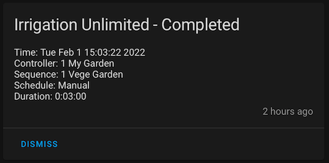

#### 10.1.2. irrigation_unlimited_switch_error, irrigation_unlimited_sync_error

These events are fired during a [check back](#510-check-back-object) operation. A `irrigation_unlimited_sync_error` is fired if the physical switch is found to be out of sync. This message will repeat for each attempted resync. After the specified number of retries have been exhusted a `irrigation_unlimited_switch_error` is fired. Additional information is available that can be used in automation scripts.

| Field | Description |
| ----- | ----------- |
| `entity_id` | A CSV list of entities. |
| `expected` | The expected state of the switch. |
| `controller.index` | The sequential index of the controller. |
| `controller.name` | The friendly name of the controller. |
| `zone.index` | The sequential index of the zone. |
| `zone.name` | The friendly name of the zone. Note: This maybe blank/empty (None) if it was the controller switch. |

Example to send an email on switch failure. There are two parts to this procedure, the first is to setup an email notification for your provider. See [here](https://www.home-assistant.io/integrations/smtp/#google-mail) for a google mail example. The next is to use the notifier.

```yaml
automation:
  - id: "IU1653340138435"
    alias: "Irrigation Unlimited Switch Error"
    description: "Email a switch syncronisation error"
    trigger:
      - platform: event
        event_type:
          # - irrigation_unlimited_sync_error
          - irrigation_unlimited_switch_error
    action:
      - service: notify.NOTIFIER_NAME # Make sure this matches the "NOTIFIER_NAME" in the smtp setup
        data:
          title: "Irrigation Switch Error"
          message: |
            Type: {{ trigger.event.event_type }}
            Time: {{ as_local(trigger.event.time_fired).strftime('%c') }}
            Expected: {{ trigger.event.data.expected }}
            Controller: {{ trigger.event.data.controller.index + 1 }} {{ trigger.event.data.controller.name }}
            
              Zone: {{ trigger.event.data.zone.index + 1 }} {{ trigger.event.data.zone.name }}
            
            Entity: {{ trigger.event.data.entity_id }}
```

## 11. Troubleshooting

There should be little trouble installing this component, please use the _[HACS](#41-install-from-hacs)_ method where possible. Binary sensors are created automatically. However, if you experience difficulties please check the following:

### 11.1. Requirements

This integration depends on two other components; _[recorder](https://www.home-assistant.io/integrations/recorder/)_ and _[history](https://www.home-assistant.io/integrations/history/)_. Both of these components are part of the standard Home Assistant installation and enabled by default with the `default_config:` line in the configuration. If you have removed this line then a `history:` and `recorder:` section must be setup manually. If a mistake is made in either one of these configurations then they will not start and in turn, Irrigation Unlimited for which it depends on, will not start. Please check the log file for the following lines:

```text
2021-08-03 12:12:40 INFO (MainThread) [homeassistant.setup] Setting up recorder
2021-08-03 12:12:40 INFO (MainThread) [homeassistant.setup] Setup of domain recorder took 0.1 seconds
...
2021-08-03 12:12:42 INFO (MainThread) [homeassistant.setup] Setting up history
2021-08-03 12:12:42 INFO (MainThread) [homeassistant.setup] Setup of domain history took 0.0 seconds
```

The above shows the requirements were loaded successfully. Note: The lines may not be consecutive in the log. If you do not see these lines then go back to basics and remove any `history:` and `recorder:` sections and ensure the `default_config:` line is present. Restart HA and check you have these log entries.

### 11.2. HA Configuration

There must be a `irrigation_unlimited:` section in the configuration. If the section is missing or invalid then Irrigation Unlimited will not start. Check the log file to see it successfully started up.

```text
2021-08-03 12:12:45 INFO (MainThread) [homeassistant.setup] Setting up irrigation_unlimited
...
2021-08-03 12:12:47 INFO (MainThread) [homeassistant.setup] Setup of domain irrigation_unlimited took n.n seconds
```

The above shows that Irrigation Unlimited loaded successfully. Note: The lines will most likely not be together so do a search. If it failed then use the minimal configuration shown _[here](#61-minimal-configuration)_. This is a good starting point to get acquainted with this integration.

### 11.3. Logging

For more detailed information set your logging for the component to debug:

```yaml
logger:
  default: info
  logs:
    custom_components.irrigation_unlimited: debug
```

### 11.4. Last but not least

If all else fails please open an [issue](https://github.com/rgc99/irrigation_unlimited/issues).

## 12. Notes

1. All feature requests, issues and questions are welcome.

<a href="https://www.buymeacoffee.com/rgc99" target="_blank"></a><!---->

## 13. Snake case

 The [controller_id](#51-controller-objects), [zone_id](#53-zone-objects) and [schedule_id](#55-schedule-objects) identifiers need to be in snake_case like `my_garden`, `vege_patch`, `rose_bed`, `front_lawn`, `before_dawn`. The allowable characters are lower case alphabet, numerals and the underscore. The underscore cannot be used as a leading or trailing character and not more than one together. For more information see [here](https://en.wikipedia.org/wiki/Snake_case)

## 14. Parameter Types

### 14.1 Irrigation Unlimited Entities

This parameter specifies one or more Irrigation Unlimited entities such as 'binary_sensor.irrigation_unlimited_c1_z1'. Multiple entities can be a CSV string or a list. Here is a code snippet to show different ways to specify the entity_ids.

```yaml
  ...
  entity_id: binary_sensor.irrigation_unlimited_c1_z1
  entity_id: binary_sensor.irrigation_unlimited_c1_z1,binary_sensor.irrigation_unlimited_c1_z2
  entity_id:
    - binary_sensor.irrigation_unlimited_c1_z1
    - binary_sensor.irrigation_unlimited_c1_z2
  ...
```

### 14.2 Duration (Time Period)

The time period (duration) type is a string in the format HH:MM, HH:MM:SS, the number of seconds or a dictionary. Time type must be a positive value unless otherwise noted. The value will be rounded down to the system granularity. The default granularity is one second. This is the heart beat or system pulse. All times will be synchronised to these boundaries. Here are different ways to specify 10 minutes.

```yaml
  ...
  time: '00:10' # HH:MM
  time: '0:10:00' # H:MM:SS
  time: '00:10:00' # HH:MM:SS
  time: 600 # Seconds
  time: # One or more or the following
    days: 0
    hours: 0
    minutes: 10
    seconds: 0
  ...
```

### 14.3 Switch entities

These can be any entity from the `switch` or `light` platforms or anything that supports the `turn_on` and `turn_off` actions. Multiple entities can be a CSV string or a list. Here is a code snippet to show different ways to specify the entity_ids.

```yaml
  ...
  entity_id: switch.valve_1
  entity_id: light.valve_1,light.valve_2
  entity_id:
    - switch.valve_1
    - light.valve_2
  ...
```

In case you wish to control some other device like a motorised valve that presents itself in Home Assistant as a cover then adapt the following automation.

```yaml
automation:
  - alias: 'Zone 1 motorised valve'
    description: Turn on/off motorised valve
    trigger:
      - platform: state
        entity_id:
          - binary_sensor.irrigation_unlimited_c1_z1
    condition: []
    action:
      - service: |-
          
            cover.open_cover
          
            cover.close_cover
          
        entity_id: cover.my_cover_1
    mode: single
```

### 14.4 Templating

Some parameters support [templating](https://www.home-assistant.io/docs/configuration/templating). Actual support is noted in the relevant documentation.

Templating is an advanced Home Assistant scripting technique. In many cases such as scripts and automations templating is built in. In other situations like the tap action from a button card, templating is not available but the string will be passed to the service call. Irrigation Unlimited will detect the string contains a template and convert it. Here are some examples that retrieve data from an input text box and pass it to a service call.

```yaml
  ...
  action:
    service: irrigation_unlimited.adjust_time
    service_data:
      percentage: "{{ states('input_text.adjustment') | float(100) }}"
  ...
  action:
    service: irrigation_unlimited.manual_run
    service_data:
      time: "{{ states('input_text.run_time') | default('00:00') }}"
```

### 14.5 Sequence

Sequence to adjust, a number (1, 2..N). This is the position number of the sequence under the controller. `sequence_id: 1` is the first, 2 is the second and so on. As a shortcut, `sequence_id: 0` will alter _all_ sequences. Within a controller, sequences are numbered by their position starting at 1. Only relevant when entity_id is a controller/master. An error message will be generated if a `sequence_id` is specified and `entity_id` is not a controller/master.

### 14.6 Zones

Zone(s) to adjust, number/list (1, 2..N). This is the position number of the zone reference under the sequence. `zones: 1` is the first, 2 is the second and so on. As a shortcut, `zones: 0` will alter _all_ zones. Within a sequence, zones are numbered by their position starting a 1.

### 14.7 Time (Time of Day)

The time of day type is a string in the format HH:MM or HH:MM:SS. It is assumed to be in the local time.

## 15. Contributions are welcome

If you want to contribute to this please read the [Contribution guidelines](CONTRIBUTING.md).

## 16. Credits

Code template was mainly taken from [@Ludeeus](https://github.com/ludeeus)'s [integration_blueprint][integration_blueprint] template.

Some inspiration was taken from [kloggy's](https://github.com/kloggy/HA-Irrigation-Version2) work.

---

[buymecoffee]: https://www.buymeacoffee.com/rgc99
[buymecoffeebadge]: https://img.shields.io/badge/buy%20me%20a%20coffee-donate-yellow.svg?style=for-the-badge
[commits-shield]: https://img.shields.io/github/commit-activity/y/rgc99/irrigation_unlimited?style=for-the-badge
[commits]: https://github.com/rgc99/irrigation_unlimited/commits/master
[hacs]: https://github.com/custom-components/hacs
[hacsbadge]: https://img.shields.io/badge/HACS-Custom-orange.svg?style=for-the-badge
[forum-shield]: https://img.shields.io/badge/community-forum-brightgreen.svg?style=for-the-badge
[forum]: https://community.home-assistant.io/t/irrigation-unlimited-integration/
[maintenance-shield]: https://img.shields.io/badge/maintainer-Robert%20Cook%20%40rgc99-blue.svg?style=for-the-badge
[releases-shield]: https://img.shields.io/github/release/rgc99/irrigation_unlimited.svg?style=for-the-badge
[releases]: https://github.com/rgc99/irrigation_unlimited/releases
[license-shield]: https://img.shields.io/github/license/rgc99/irrigation_unlimited.svg?style=for-the-badge
[license]: LICENSE
[integration_blueprint]: https://github.com/custom-components/integration_blueprint
